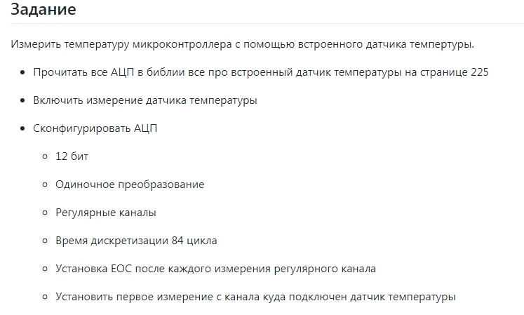
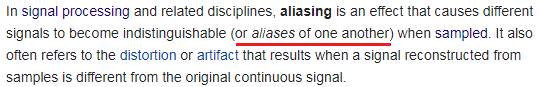
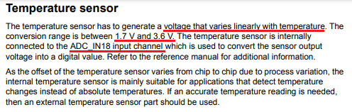
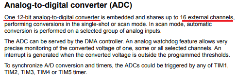
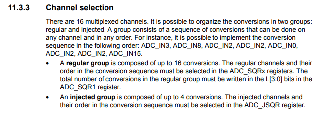
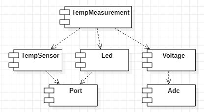
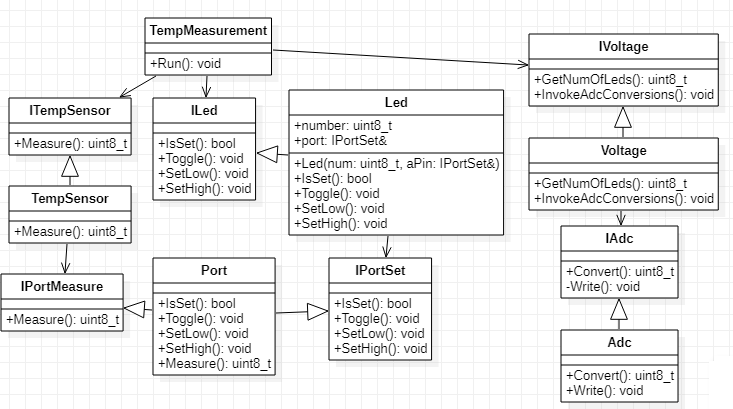

# Lab7_ADC

## Содержание 

1. [Исходное задание](#requirements)
2. [Теоретический материал](#theory)
3. [Подбор параметров](#parameters)
4. [Проектирование системы](#design)
5. [Написание кода](#coding)
6. [Использованная литература](#literature)

## Исходное задание <dev id="requirements"></dev>



## Теоретический материал <dev id="theory"></dev>

### Семплирование 

<!--
Разница между аналоговым и цифровым сигналом.
И проблема того, что с помощью цифровых устройств можно измерять сигнал лишь в определённые дискретные моменты времени. 
-->

**Дискретизация**, или **семплирование**, (англ. **Sampling**) - это процесс преобразования непрырывного во времени сигнала к дискретному виду. 

**Выборка**, или **семпл**, (англ. **Sample**) - это значение или набор значений в некоторой точке времени или пространства. 

**Приёмником**, или **семплером**, (англ. **Sampler**) может называться как прибор, так и операция, которые извлекают *семплы* из непрерывного сигнала. 

**Частота дискретизации** (англ. **Sampling rate**) - это количественная характеристика, выражающая число извлечённых семплов в секунду. 

**Алиасинг** (англ. **Aliasing**) - это эффект наложения двух и более сигналов друг на друга до степени неразличимости этих сигналов. 

Это явление может происходить, когда частота семплирования слишком низкая (в таком случае говорят об *Undersampling*). 


Таким образом, при низкой частоте дискретизации (т.е. при малом количестве снятых измерений, или **undersampling**) восстановленный по семплам сигнал может очень сильно искажаться по сравнению с исходным сигналом. 

Интересное определение понятия *алиасинг* даётся в статье на [Википедии](https://en.wikipedia.org/wiki/Aliasing): 



Тут присутствует игра слов, заключающаяся в том, что *alias* с английского переводится как "псевдоним" или "ложно идентифицированный". 
Таким образом, при *алиасинге* один сигнал может быть принят за другой сигнал ввиду того, что его неправильно идентифицировали (т.е. два этих перепутанных между собой сигнала в некотором смысле становятся "псевдонимами" друг друга). 

Согласно **теореме Котельникова**, или **теореме Найквиста-Шеннона**, (англ. **Nyquist–Shannon sampling theorem**), на входе АЦП требуется аналоговый ФНЧ, называемый **фильтром сглаживания** (англ. **anti-aliasing filter**). 
То есть входной сигнал должен быть ограничен *полосой пропускания* для предотвращения наложения спектров (алиасинга). 

Дело в том, что при алиасинге волны более высокой частоты могут быть записаны как волны более низкой частоты.

Исходя из того же соображения, на выходе ЦАП необходим *реконструкционный фильтр* (один из видов ФНЧ) для восоздания из последовательности *семплов* исходного сигнала.
Это делается для того, чтобы сигнал низкой частоты не был ложно реконструирован как сигнал высокой частоты. 

*Теорема Найквиста-Шеннона* устанавливает достаточное условие для *частоты дискретизации*, которое позволяет последовательности дискретных семплов извлекать всю информацию из непрерывного сигнала конечной полосы пропускания.

В общем случае, чем с большей частотой будет производиться конвертация аналогового сигнала в цифровой, тем точнее будет восстановлен исходный сигнал по дискретным значениям. 
В теории обработки сигналов есть специальное понятие, обозначающее значительное увеличение числа ковертаций - *оверсэмплинг*. 

**Оверсэмплинг** (англ. **Oversampling**) - это процесс дискретизации аналогового сигнала с частотой, значительно превышающей **скорость Найквиста** (англ. **Nyquist rate**). 

Разница между понятиями *Bandwidth*, *Nyquist frequency*, *Nyquist rate*, *sample rate* представлена на рисунке ниже: 


**Частота Найквиста** (англ. **Nyquist frequency**) - это характеристика АЦП, значение которой в *циклов на секунду* в два раза больше *частоты сэмплирования* (англ. *sample rate*), измеряемой в *сэплах на секунду*. 

**Nyquist rate** - это минимальная частота, на которой можно сэплировать сигнал без угрозы *undersampling*'а. 
Говорят, что сигнал передисретизирован в *n* раз, если этот сигнал сэмплируется с частотой, в *n* раз превышающей *Nyquist rate*. 

Если наибольшая частота *полосы пропускания* (англ. *Bandwidth*) меньше *частоты Найквиста* (англ. *Nyquist frequency*), то считается, что полученная дискретная последовательность свободна от искажения, называемого *алиасинг*, и соответствующая *частота сэмплирования* больше, чем *Nyquist rate*. 

<!--
Методы восстановления сигнала по неполным данным. 
-->

### АЦП  

**Аналогово-цифровой преобразователь** (**АЦП**, англ. **Analog-to-Digital Converter**, **ADC**) - это устройство, которое преобразует аналоговый сигнал в цифровой сигнал. 

Кроме того, АЦП собирает и конвертирует аналоговый сигнал в цифровой не постоянно, а периодично, ограничивая при этом допустимую полосу пропускания входного сигнала. 

<!--
Общая информация о том, как работают АЦП. 
Типы АЦП. 
-->


<!--
1. Какое количество преобразований возможно в АЦП.
2. Какие каналы бывают: регулярные и ижектированные. 
-->

**Разрядность АЦП** (англ. **Resolution**) - это количественный параметр АЦП, кторый показывает колчиество дискретных значений в допустимом диапазоне измерения входной величины. 

[Здесь](https://en.wikipedia.org/wiki/Oversampling#Resolution) описано, каким образом *oversampling* позволяет искуственно увеличить разрядность АЦП. 

**Ошибка квантования** (англ. **Quantization error**) - это разница между аналоговым сигналом и ближайшим доступным цифровым значением в каждый момент выборки из аналого-цифрового преобразователя. 

Ошибка квантования также вносит шум, называемый шумом квантования, в сигнал выборки. 
Чем выше разрешение аналого-цифрового преобразователя, тем меньше ошибка квантования и меньше шум квантования. 

**Отношение сигнала к ошибке** (англ. **signal-to-noise ratio**, **SNR**) - это параметр, измеряемый в децибелах и показывающий уровень (точнее сказать, мощность) исследуемого сигнала к мощности сопровождающих этот сигнал шумам. 

Если `SNR > 1:1` (или `SNR > 0 dB`), то сигнала больше, чем шум. 

Соотношение между разрешением (в битах) и шумом квантования для идеального аналого-цифрового преобразователя можно выразить как: 
```
SNR = 20*log10(2^Q) = 6.02*Q dB
```
где `SNR` - отношение сигнала к ошибке; 
    `Q` - количество битов квантования (разрядность АЦП). 

То есть, чем больше разрядность АЦП, тем больше полезного сигнала будет получено по сравнению с шумам. 

В АЦП есть *регулярные каналы* и *инжектированные каналы*. 

Суть **инжектированного канала** (англ. **Injected channel**) заключается в том, что у него есть своя отдельная ячейка для сохранения результата. То есть если каналы микроконтроллера настроить как инжектированные, то результаты будут сохранены в четыре разные ячейки.

Инжектированных каналов может быть не больше четырёх. 
Любой аналоговый вход можно настроить как инжектированный.

У **регулярных каналов** (англ. **Regular channel**) всего одна ячейка на всех. То есть если каналы микроконтроллера настроить как регулярные, то результат работы каждого канала будет записываться в одну и ту же ячейку, затирая предыдущие данные. 
Своевременно забирать результаты нам поможет DMA ([источник](https://istarik.ru/blog/stm32/113.html)).

*Инжектированный канал* может обеспечивать преобразование в АЦП во время преобразования регулярных каналов по некоторому событию (по таймеру, по какому-либо внешнему или программному событию). 
Преобразования на инжектированном канале имеет более высокий приоритет по сравнению с регулярным каналом и, таким образом, может обеспечивать прерывания преобразований на регулярных каналах.

<!--
**Single conversion mode** - это. 

most significant bit (msb)

least significant bit (lsb)
-->

Подробную информацию о том, как работает АЦП в микроконтроллере STM32F411 можно в [лекции](https://github.com/lamer0k/Lections/blob/master/Lection6.adoc) и в [документации](https://www.st.com/resource/en/datasheet/stm32f411re.pdf). 

В [Reference manual](https://www.st.com/resource/en/reference_manual/dm00119316-stm32f411xc-e-advanced-arm-based-32-bit-mcus-stmicroelectronics.pdf) описаны регистры для работы с микронтроллером. 

## Подбор параметров <dev id="parameters"></dev>

<!--
Параметры подбираются исходя из документации: 
- Определение каналов, с которых можно брать измерения; 
- Почему выбрано именно 84 цикла (имеет ли это что-то общее с тем, что измерение только одно); 
- Какое количество преобразований может выполнить микроконтроллер STM32F411; 
- Количество бит; 
- Количество возможных преобразований; 
- Как производится настройка АЦП, если измерений нужно будет сделать много; 
- Какие есть биты конца преобразования (`EOC`) в микроконтроллере STM32F411. 
-->

Информация о температурном датчике по [документации](https://www.st.com/resource/en/datasheet/stm32f411re.pdf): 



Информация об АЦП по [документации](https://www.st.com/resource/en/datasheet/stm32f411re.pdf): 



Выбор канала АЦП (из [Reference manual](https://www.st.com/resource/en/reference_manual/dm00119316-stm32f411xc-e-advanced-arm-based-32-bit-mcus-stmicroelectronics.pdf)): 



Допустим, *АЦП* будет подсоединён к *микроконтроллеру* через канал `ADC_IN0`, а *датчик температуры* - к *АЦП* через канал `ADC_IN18`. 

<!--
The conversion time is given by the clock frequency. It takes approximately 64 clock cycles to perform one 8-bit conversion. Thus, to obtain a sampling rate of say 10 000 samples per second, the clock frequency needs to be set to:
f = 64 * 10*10^3 = 640 kHz. 

The conversion time is thus: 
T = 64 / 640 kHz = 10 us. 
-->

## Проектирование системы <dev id="design"></dev>

Данная программа должна выполнять слеующие функции: 
- Настраивать датчик температуры, АЦП, светодиоды и таймер (если нужно); 
- Измерять температуру с помощью датчика температуры; 
- Преобразовывать аналогвый сигнал температуры в цифровой сигнал напряжения с помощью АЦП; 
- Восстанавливать по значениям напряжения измеренное значение температуры; 
- По значению восстановленной температуры принимать решение, сколько светодиодов должно гореть; 
- Зажигать светодиоды пропорционально тому, сколько светодиодов должно гореть. 

Statechart диаграмма показывает, в каких состояниях может находиться данное приложение: 


Таким образом, приложение состоит из следующих компонентов: 
- **TempMeasurement** - главный контроллер данного приложения (вызывает методы температурного датчика, светодиода и контроллера напряжения); 
- **TempSensor** - настройка встроенного датчика температуры; 
- **Led** - конфигурация и включение/выключение светодиодов.  
    Светодиод должен иметь методы: 
    - `bool IsSet()`; 
    - `void SetHigh()`;
    - `void SetLow()`;  

- **Voltage** - интерпретация измеренных значений температуры и вызов АЦП; 
- **Adc** - конфигурация АЦП, снятие измеренных значений и записывание их в регистр данных; 
- **Port** - порт.

Диаграмма компонентов: 



Диаграмма классов: 



Компоненты, связанные с температурным датчиком, не были реализованы ввиду недостаточного понимания принципа работы температурного датчика. 

## Написание кода <dev id="coding"></dev>

При написании кода выяснилось, что большинство регистров не совпадают с [примером](https://github.com/lamer0k/stm32Labs/tree/master/Lab7), поэтому приходилось проверять допустимые значения регистров из папки Registers и сверять их с [Reference manual](https://www.st.com/resource/en/reference_manual/dm00119316-stm32f411xc-e-advanced-arm-based-32-bit-mcus-stmicroelectronics.pdf). 

То есть, в примере канал АЦП определён следующим образом: 
```
ADC1::SQR3::SQ1::Channel18::Set() ;
```
А в настоящем отчёте вот так: 
```
ADC1::SQR3::SQ1::Value18::Set();
```

Таким образом определены почти все регистры, кроме структуры `ADC1_SMPR1_SMPx_x_Values` (для неё было скопировано опредёление регистров [отсюда](https://github.com/lamer0k/stm32Labs/blob/master/Lab7/AbstractHardware/Registers/STM32F411/FieldValues/adc1fieldvalues.hpp)).

Файл `port.h`:
```
#pragma once

#include "gpiocregisters.hpp" 
#include "gpioaregisters.hpp" 
#include "rccregisters.hpp" 

#include <cstdint>
#include <cassert>

class IPortSet
{
public:
  virtual bool IsSet(std::uint8_t num) = 0;
  virtual void SetHigh(std::uint8_t num) = 0;
  virtual void SetLow(std::uint8_t num) = 0;
  virtual void Toggle(std::uint8_t num) = 0;
};

class IPortMeasure
{
public:
  virtual std::uint8_t Measure() = 0;
};

template <typename Reg>
class Port: public IPortSet, public IPortMeasure
{
public:
  bool IsSet(std::uint8_t num) override
  {
    return (Reg::IDR::Get()&(1<<num)) != 0;
  }
  
  void SetHigh(std::uint8_t num)
  {
    Reg::ODR::Write(1 << num); 
  }
  
  void SetLow(std::uint8_t num)
  {
    Reg::ODR::Write(1 << num); 
  }
  
  void Toggle(std::uint8_t num) override
  {
     assert (num < 16);
     Reg::ODR::Toggle(1 << num);
   }

  std::uint8_t Measure() override
  {
     return Reg::IDR::Get();
  }
};
```

Файл `portsconfig.hpp`:
```
#pragma once

#include "gpiocregisters.hpp" //for GPIOC
#include "gpioaregisters.hpp" //for GPIOA

#include "port.h"

inline  Port<GPIOC> portC;
inline  Port<GPIOA> portA;
```

Файл `Led.hpp`: 
```
#pragma once

#include "port.h"

class ILed
{
public:
  virtual ~ILed() {}
  virtual bool IsSet() = 0;
  virtual void SetHigh() = 0;
  virtual void SetLow() = 0;
  virtual void Toggle() = 0;
};

class Led: public ILed
{
public:
  Led(std::uint8_t num, IPortSet& aPin);
  ~Led();
  bool IsSet(); 
  void SetHigh();
  void SetLow(); 
  void Toggle();

private:
  std::uint8_t number; 
  IPortSet& port;
};
```

Файл `Led.cpp`: 
```
#include "Led.hpp"

Led::Led(uint8_t num, IPortSet& aPin): number(num), port(aPin)
{
}

Led::~Led() 
{
}

bool Led::IsSet()
{
  return port.IsSet(number);
}

void Led::SetHigh()
{
   port.SetHigh(number);
}

void Led::SetLow()
{
   port.SetLow(number);
}

void Led::Toggle()
{
   port.Toggle(number);
}
```

Файл `Voltage.hpp`:
```
#pragma once

#include "Adc.hpp"

#include "adc1registers.hpp"

#include <cstdint>
#include <iostream>

class IVoltage
{
public: 
  virtual ~IVoltage() {}
  virtual std::uint8_t GetNumOfLeds() = 0; 

private: 
  virtual void InvokeAdcConversions() = 0;
};

class Voltage: public IVoltage
{
public: 
  Voltage(); 
  std::uint8_t GetNumOfLeds(); 

private: 
  void InvokeAdcConversions(); 
  
  float V25 = 0.76f;
  float Avg_Slope = 0.0025f;
  float Temperature = 0.0f;
  
  std::int8_t minTemp = - 40; 
  std::int8_t maxTemp = 125; 
};
```

Файл `Voltage.cpp`:
```
#include "Voltage.hpp"

Voltage::Voltage()
{
}

void Voltage::InvokeAdcConversions()
{
  IAdc* adc = new Adc();
  uint8_t result = adc->Convert();
  adc->~IAdc(); 
}

std::uint8_t Voltage::GetNumOfLeds()
{
  /*
  Note that supported temperature range of the ADC: –40 to 125 °C. 

  @returns number of LEDs to switch on. 
  */
  
  Voltage::InvokeAdcConversions();
  
  std::uint32_t data = ADC1::DR::Get(); 
  Temperature = ((((data*3.3f)/4096 - V25)/Avg_Slope) + 25.0f);
  
  std::cout << "Temperature: " <<  Temperature << std::endl;
  
  std::uint8_t tempStep = (maxTemp - minTemp) / 4;      // By default there's only 4 LEDs. 
  std::uint8_t numOfLeds = 0; 
  
  /*
  * If temperature is less than max temperature and more than min temperature, 
  * you can continue calculating number of LEDs to be on. 
  *
  * If temperature is outside the allowed range, just ignore this if statement 
  * and then return number of LEDs that is zero by default. 
  */
  if (Temperature < maxTemp && Temperature > minTemp)
  {
    for (std::uint8_t i = 0; i < 4; i++)         // By default there's only 4 LEDs. 
    {
      std::uint8_t temp_ref = minTemp + (tempStep * i); 
      
      if (Temperature >= temp_ref)
      {
        numOfLeds++; 
      }
    }
  }
  
  return numOfLeds; 
}

extern Voltage voltage;
```

Файл `Adc.hpp`:
```
#pragma once

#include <cstdint>

class IAdc 
{
public: 
  virtual ~IAdc() {}
  virtual uint8_t Convert() = 0;

private: 
  virtual void Write() = 0;
};

class Adc: public IAdc
{
public: 
  Adc(); 
  uint8_t Convert();

private: 
  void Write();
};
```

Файл `Adc.cpp`:
```
#include "Adc.hpp"
#include "adc1registers.hpp"

Adc::Adc() 
{
}

uint8_t Adc::Convert()
{
  ADC1::CR2::SWSTART::Value1::Set();            // Start conversion. 
  while(ADC1::SR::EOC::Value0::IsSet());        // While conversion not complete.
  
  return 0; 
}

void Adc::Write()
{
}
```

Файл `TempMeasurement.hpp`:
```
#pragma once

#include "port.h"
#include "portsconfig.h"
#include "Led.hpp"
#include "Voltage.hpp"

#include <cstdint>

class TempMeasurement
{
public: 
  TempMeasurement();
  void Run(); 
}; 

extern TempMeasurement tm;
```

Файл `TempMeasurement.cpp`:
```
#include "TempMeasurement.hpp"

TempMeasurement::TempMeasurement()
{
}

void TempMeasurement::Run()
{
  // Create an instance of class Voltage. 
  IVoltage* voltage = new Voltage();
  
  // Get number of LEDs to be on. 
  std::uint8_t num_leds = voltage->GetNumOfLeds(); 
  
  // Delete an instance of class Voltage. 
  voltage->~IVoltage();
  
  // Create instances of class Led. 
  ILed* led01 = new Led(5, portC);
  ILed* led02 = new Led(8, portC);
  ILed* led03 = new Led(9, portC);
  ILed* led04 = new Led(5, portA);
  
  // Make an array of LEDs. 
  ILed* LedsArray[4] = {
    led01, 
    led02,
    led03, 
    led04
  }; 
  
  // Switch on (and switch off) required LEDs in for cycle. 
  for (std::uint8_t i = 0; i < sizeof(LedsArray); i++)
  {
    if (i <= num_leds)
    {
      LedsArray[i]->SetHigh();  // Set high. 
    }
    else
    {
      LedsArray[i]->SetLow();   // Set low. 
    }
  }
  
  delete LedsArray;
  
  // Delete instances of class Led. 
  led01->~ILed();
  led02->~ILed();
  led03->~ILed();
  led04->~ILed();
}
```

Файл `main.cpp`
```
#include "TempMeasurement.hpp"

#include "rccregisters.hpp"
#include "gpiocregisters.hpp"
#include "gpioaregisters.hpp"
#include "adc1registers.hpp"
#include "adccommonregisters.hpp"

extern "C"
{
  int __low_level_init(void)
  {
    RCC::CR::HSEON::On::Set();
    while (!RCC::CR::HSERDY::Ready::IsSet());
    RCC::CFGR::SW::Hse::Set();

    while (!RCC::CFGR::SWS::Hse::IsSet());
    RCC::CR::HSION::Off::Set();
    
    // Configure ADC. 
    RCC::APB2ENR::ADC1EN::Enable::Set();
    ADC1::SQR3::SQ1::Value18::Set();            // Channel 18 (for temperature sensor). 
    ADC_Common::CCR::TSVREFE::Value1::Set();    // Temperature sensor and VREFINT channel enabled. 
    ADC1::CR1::RES::Value0::Set();              // 12-bit (15 ADCCLK cycles)
    ADC1::CR2::CONT::Value0::Set();             // Single conversion mode. 
    ADC1::CR2::EOCS::Value0::Set();             // The EOC bit is set at the end of each sequence of regular conversions. Overrun detection is enabled only if DMA=1.
    ADC1::SQR1::L::Value0::Set();               // 1 conversion. 
    ADC1::SMPR1::SMP18::Cycles84::Set();        // 84 cycles. 
    ADC1::CR2::ADON::Value1::Set();             // Enable ADC. 
    
    return 1;
  }
}

int main()
{
  TempMeasurement tm; 
  tm.Run();
  
  return 0;
}
```

## Использованная литература <dev id="literature"></dev>

- https://en.wikipedia.org/wiki/Sampling_(signal_processing)
- https://en.wikipedia.org/wiki/Nyquist%E2%80%93Shannon_sampling_theorem
- https://en.wikipedia.org/wiki/Aliasing
- https://en.wikipedia.org/wiki/Anti-aliasing_filter
- [The Engineer’s Guide to Temperature Sensing - Texas Instruments](https://www.ti.com/lit/eb/slyy161/slyy161.pdf?ts=1613291605076&ref_url=http%253A%252F%252Fwww.google.com%252Fsearch%253Fq%253Dexpress%2Bof%2Bthe%2Bactive%2Bsensor%2Band%2Bpassive%2Bsensor%2Bin%2Bexamples%2Bof%2Bworiking%2Bprinciple%2Binstrumentation%2Bengineering%2B%253F%2526client%253Dms-opera-mini-android%2526ei%253DqN0oYNrhKsymaKjPg-AN%2526start%253D10%2526sa%253DN)
- https://en.wikipedia.org/wiki/Analog-to-digital_converter
- https://en.wikipedia.org/wiki/Oversampling
- https://stackoverflow.com/questions/59940684/whats-the-difference-between-nyquist-rate-and-nyquist-frequency
- https://istarik.ru/blog/stm32/113.html
- https://electronics.stackexchange.com/questions/83426/what-is-the-difference-between-an-injected-and-regular-stm32-adc-channel