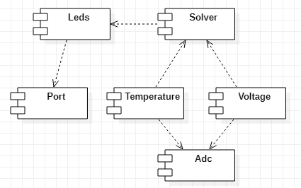
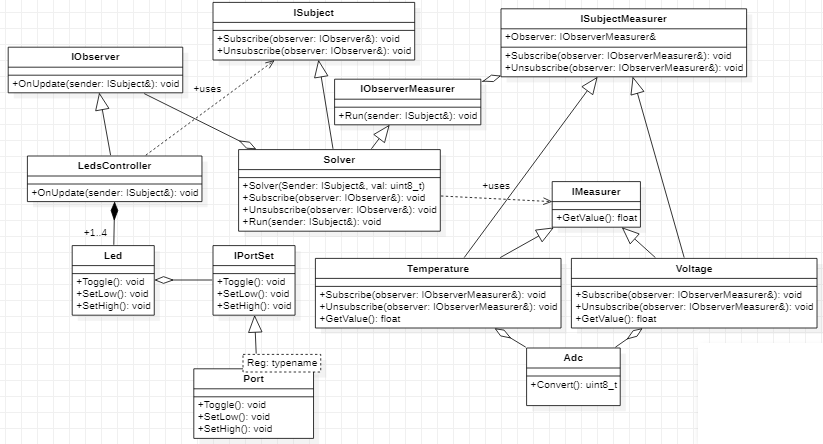

# Lab7_ADC

## Содержание 

1. [Исходное задание](#requirements)
2. [Теоретический материал](#theory)
2. [Шаблон Observer](#observer)
3. [Подбор параметров](#parameters)
4. [Проектирование системы](#design)
5. [Написание кода](#coding)
6. [Использованная литература](#literature)

## Исходное задание <dev id="requirements"></dev>


Сделать измерение температуры, напряжения с канала 0 и опорного напряжения в режиме Continious. 

Задача под звёздочкой: попробовать сделать тоже самое с помощью DMA - модуля прямого доступа к памяти. 

## Теоретический материал <dev id="theory"></dev>

### Семплирование

**Дискретизация**, или **семплирование**, (англ. **Sampling**) - это процесс преобразования непрырывного во времени сигнала к дискретному виду. 

**Выборка**, или **семпл**, (англ. **Sample**) - это значение или набор значений в некоторой точке времени или пространства. 

**Приёмником**, или **семплером**, (англ. **Sampler**) может называться как прибор, так и операция, которые извлекают *семплы* из непрерывного сигнала. 

**Частота дискретизации** (англ. **Sampling rate**) - это количественная характеристика, выражающая число извлечённых семплов в секунду. 

**Алиасинг** (англ. **Aliasing**) - это эффект наложения двух и более сигналов друг на друга до степени неразличимости этих сигналов. 

Это явление может происходить, когда частота семплирования слишком низкая (в таком случае говорят об *Undersampling*). 


Таким образом, при низкой частоте дискретизации (т.е. при малом количестве снятых измерений, или **undersampling**) восстановленный по семплам сигнал может очень сильно искажаться по сравнению с исходным сигналом. 

Интересное определение понятия *алиасинг* даётся в статье на [Википедии](https://en.wikipedia.org/wiki/Aliasing): 


Тут присутствует игра слов, заключающаяся в том, что *alias* с английского переводится как "псевдоним" или "ложно идентифицированный". 
Таким образом, при *алиасинге* один сигнал может быть принят за другой сигнал ввиду того, что его неправильно идентифицировали (т.е. два этих перепутанных между собой сигнала в некотором смысле становятся "псевдонимами" друг друга). 

Согласно **теореме Котельникова**, или **теореме Найквиста-Шеннона**, (англ. **Nyquist–Shannon sampling theorem**), на входе АЦП требуется аналоговый ФНЧ, называемый **фильтром сглаживания** (англ. **anti-aliasing filter**). 
То есть входной сигнал должен быть ограничен *полосой пропускания* для предотвращения наложения спектров (алиасинга). 

Дело в том, что при алиасинге волны более высокой частоты могут быть записаны как волны более низкой частоты.

Исходя из того же соображения, на выходе ЦАП необходим *реконструкционный фильтр* (один из видов ФНЧ) для восоздания из последовательности *семплов* исходного сигнала.
Это делается для того, чтобы сигнал низкой частоты не был ложно реконструирован как сигнал высокой частоты. 

*Теорема Найквиста-Шеннона* устанавливает достаточное условие для *частоты дискретизации*, которое позволяет последовательности дискретных семплов извлекать всю информацию из непрерывного сигнала конечной полосы пропускания.

В общем случае, чем с большей частотой будет производиться конвертация аналогового сигнала в цифровой, тем точнее будет восстановлен исходный сигнал по дискретным значениям. 
В теории обработки сигналов есть специальное понятие, обозначающее значительное увеличение числа ковертаций - *оверсэмплинг*. 

**Оверсэмплинг** (англ. **Oversampling**) - это процесс дискретизации аналогового сигнала с частотой, значительно превышающей **скорость Найквиста** (англ. **Nyquist rate**). 

Разница между понятиями *Bandwidth*, *Nyquist frequency*, *Nyquist rate*, *sample rate* представлена на рисунке ниже: 


**Частота Найквиста** (англ. **Nyquist frequency**) - это характеристика АЦП, значение которой в *циклов на секунду* в два раза больше *частоты сэмплирования* (англ. *sample rate*), измеряемой в *сэплах на секунду*. 

**Nyquist rate** - это минимальная частота, на которой можно сэплировать сигнал без угрозы *undersampling*'а. 
Говорят, что сигнал передисретизирован в *n* раз, если этот сигнал сэмплируется с частотой, в *n* раз превышающей *Nyquist rate*. 

Если наибольшая частота *полосы пропускания* (англ. *Bandwidth*) меньше *частоты Найквиста* (англ. *Nyquist frequency*), то считается, что полученная дискретная последовательность свободна от искажения, называемого *алиасинг*, и соответствующая *частота сэмплирования* больше, чем *Nyquist rate*. 

<!--
Методы восстановления сигнала по неполным данным. 
-->

### АЦП  

**Аналогово-цифровой преобразователь** (**АЦП**, англ. **Analog-to-Digital Converter**, **ADC**) - это устройство, которое преобразует аналоговый сигнал в цифровой сигнал. 

Кроме того, АЦП собирает и конвертирует аналоговый сигнал в цифровой не постоянно, а периодично, ограничивая при этом допустимую полосу пропускания входного сигнала. 

<!--
Общая информация о том, как работают АЦП. 
Типы АЦП. 
-->

<!--
1. Какое количество преобразований возможно в АЦП.
2. Какие каналы бывают: регулярные и ижектированные. 
-->

**Разрядность АЦП** (англ. **Resolution**) - это количественный параметр АЦП, кторый показывает колчиество дискретных значений в допустимом диапазоне измерения входной величины. 

[Здесь](https://en.wikipedia.org/wiki/Oversampling#Resolution) описано, каким образом *oversampling* позволяет искуственно увеличить разрядность АЦП. 

**Ошибка квантования** (англ. **Quantization error**) - это разница между аналоговым сигналом и ближайшим доступным цифровым значением в каждый момент выборки из аналого-цифрового преобразователя. 

Ошибка квантования также вносит шум, называемый шумом квантования, в сигнал выборки. 
Чем выше разрешение аналого-цифрового преобразователя, тем меньше ошибка квантования и меньше шум квантования. 

**Отношение сигнала к ошибке** (англ. **signal-to-noise ratio**, **SNR**) - это параметр, измеряемый в децибелах и показывающий уровень (точнее сказать, мощность) исследуемого сигнала к мощности сопровождающих этот сигнал шумам. 

Если `SNR > 1:1` (или `SNR > 0 dB`), то сигнала больше, чем шум. 

Соотношение между разрешением (в битах) и шумом квантования для идеального аналого-цифрового преобразователя можно выразить как: 
```
SNR = 20*log10(2^Q) = 6.02*Q dB
```
где `SNR` - отношение сигнала к ошибке; 
    `Q` - количество битов квантования (разрядность АЦП). 

То есть, чем больше разрядность АЦП, тем больше полезного сигнала будет получено по сравнению с шумам. 

В АЦП есть *регулярные каналы* и *инжектированные каналы*. 

Суть **инжектированного канала** (англ. **Injected channel**) заключается в том, что у него есть своя отдельная ячейка для сохранения результата. То есть если каналы микроконтроллера настроить как инжектированные, то результаты будут сохранены в четыре разные ячейки.

Инжектированных каналов может быть не больше четырёх. 
Любой аналоговый вход можно настроить как инжектированный.

У **регулярных каналов** (англ. **Regular channel**) всего одна ячейка на всех. То есть если каналы микроконтроллера настроить как регулярные, то результат работы каждого канала будет записываться в одну и ту же ячейку, затирая предыдущие данные. 
Своевременно забирать результаты нам поможет DMA ([источник](https://istarik.ru/blog/stm32/113.html)).

*Инжектированный канал* может обеспечивать преобразование в АЦП во время преобразования регулярных каналов по некоторому событию (по таймеру, по какому-либо внешнему или программному событию). 
Преобразования на инжектированном канале имеет более высокий приоритет по сравнению с регулярным каналом и, таким образом, может обеспечивать прерывания преобразований на регулярных каналах.

<!--
**Single conversion mode** - это. 

most significant bit (msb)

least significant bit (lsb)
-->

Подробную информацию о том, как работает АЦП в микроконтроллере STM32F411 можно в [лекции](https://github.com/lamer0k/Lections/blob/master/Lection6.adoc) и в [документации](https://www.st.com/resource/en/datasheet/stm32f411re.pdf). 

В [Reference manual](https://www.st.com/resource/en/reference_manual/dm00119316-stm32f411xc-e-advanced-arm-based-32-bit-mcus-stmicroelectronics.pdf) описаны регистры для работы с микронтроллером. 

### Stack vs Heap, Pointers and References

Почему во встроенных системах не рекомендуется использовать динамическое выделение памяти? 

**Указатель** (англ. **Pointer**) - это переменная (в некоторых языках объект), которая хранит в себе адрес памяти другой переменной или объекта. 

**Ссылка** (англ. **Reference**) - это тип данных, который позволяет программе совершать прямой доступ к конкретному элементу данных. 

**Стэк** (англ. **Stack**) - это абстракный тип данных, который содержит набор элементов и сортирует элементы по принципу *LIFO* (*last in, first out*), т.е. последний элемент стэка должен первым покинуть стэк. 

**Стэк вызовов** (англ. **Call stack**) - это стэк, хранящий информацию об активных подпроцессах исполняемой програграммы. 
Также может называться *execution stack*, *program stack*, *control stack*, *run-time stack* или *machine stack*; иногда сокращается до *stack*. 

**Куча** (англ. **Heap**) - область памяти, которая содержит в себе динамически выделяемую память.  
используется для хранения глобальных переменных. 

Разница между стэком и кучей представлена на рисунке ниже: 


Если не задумываться о своевременном освобождении памяти, то может получиться так, что *stack* и *heap* полностью заполнят свободное пространство памяти.  


При переполнении памяти система обнаружит это и вызовет ошибку. 
Старые языки просто приводят к сбою программы. 
Новые языки обычно вызывают исключение, но обработка этих исключений может быть проблематичной, потому что для этого недостаточно памяти или стэка ([источник](https://softwareengineering.stackexchange.com/questions/237667/what-happens-when-both-heap-and-stack-are-full)).

Если все ссылки на динамически выделенную память потеряны (например, был удалён указатель на нее), то это называется **утечкой памяти** (англ. **Memory leak**). 
То есть память все еще выделена, но у программиста больше нет способа получить к ней доступ.

Создавать переменные, структуры и объекты можно в куче и на стэке. 
Разница между этими способами заключается в том, что при создании на *стэке* переменная/объект исчезнет, как только прекратит своё существование область видимости, в которой она была определена. 
А переменная/объект, определённая в куче, исчезнет только когда принудительно его удалить. 

Например, нижеприведённый код на языке `C` показывает, что при статическом выделении памяти переменная `arr`, которая может быть использована за пределами своей области определения, будет недоступна ([источник](https://stackoverflow.com/questions/59846871/why-do-we-need-to-use-malloc-or-any-other-dynamic-memory-for-arrays-in-c)): 
```C++
#include <stdio.h>

char *make_array() {
    int n;  
    scanf("%d",&n);

    // Memory for `arr` is allocated on the stack.
    char arr[n];

    // And then deallocated when the function exits.
    // A good compiler and editor will warn you if you try
    // to return it.
    return arr;
}

int main() {
    // This pointer is to memory which has already been freed. Other things
    // will overwrite it.
    char *arr = make_array();

    arr[0] = 'c';
    arr[1] = '\0';

    // This could be the letter c, but it's probably gibberish.
    puts(arr);
}
```

Поэтому когда необходимо сделать так, чтобы переменная, определённая в какой-либо области, была доступна за пределами области своего определения, то рекомендуется использовать динамическое выделение памяти.

Различия в создавании объектов, реализующих некоторый интерфейс, на стеке и в куче можно представлить следующим образом:  
```C++
#include <iostream>
#include <string>

class IReference 
{
public:
    virtual ~IReference() {}
    virtual void SetValue(int value) = 0;
    virtual int GetValue() = 0;
};

class Reference : public IReference
{
public: 
    Reference();
    ~Reference();
    void SetValue(int value);
    int GetValue();

private: 
    int val; 
}; 

Reference::Reference()
{
}

Reference::~Reference() 
{
    std::cout << "Reference::~Reference() was called." << std::endl; 
} 

void Reference::SetValue(int value) 
{
    val = value; 
}

int Reference::GetValue() 
{
    return val; 
}

int main()
{
    int var = 14; 

    // Create an object of Reference implementing IReference on the stack. 
    {
        Reference refStack; 
        IReference* reference = &refStack; 
        reference->SetValue(5); 
        std::cout << "reference->GetValue() = " << reference->GetValue() << std::endl; 
        std::cout << "typeid(refStack).name(): " << typeid(refStack).name() << std::endl; 
        std::cout << "typeid(reference).name(): " << typeid(reference).name() << std::endl; 
    }

    // Create an object of Reference implementing IReference on the heap. 
    {
        IReference* refHeap = new Reference(); 
        refHeap->SetValue(var);
        std::cout << "refHeap->GetValue() = " << refHeap->GetValue() << std::endl; 
        std::cout << "typeid(refHeap).name(): " << typeid(refHeap).name() << std::endl; 
        delete refHeap; 
    }
    
    return 0;
}

// Result: 
//reference->GetValue() = 5
//typeid(refStack).name(): 9Reference
//typeid(reference).name(): P10IReference
//Reference::~Reference() was called.
//refHeap->GetValue() = 14
//typeid(refHeap).name(): P10IReference
//Reference::~Reference() was called.
```

## Подбор параметров <dev id="parameters"></dev>

<!--
Параметры подбираются исходя из документации: 
- Определение каналов, с которых можно брать измерения; 
- Почему выбрано именно 84 цикла (имеет ли это что-то общее с тем, что измерение только одно); 
- Какое количество преобразований может выполнить микроконтроллер STM32F411; 
- Количество бит; 
- Количество возможных преобразований; 
- Как производится настройка АЦП, если измерений нужно будет сделать много; 
- Какие есть биты конца преобразования (`EOC`) в микроконтроллере STM32F411. 
-->

Информация о температурном датчике по [документации](https://www.st.com/resource/en/datasheet/stm32f411re.pdf): 


Информация об АЦП по [документации](https://www.st.com/resource/en/datasheet/stm32f411re.pdf): 


Выбор канала АЦП (из [Reference manual](https://www.st.com/resource/en/reference_manual/dm00119316-stm32f411xc-e-advanced-arm-based-32-bit-mcus-stmicroelectronics.pdf)): 


Допустим, *АЦП* будет подсоединён к *микроконтроллеру* через канал `ADC_IN0`, а *датчик температуры* - к *АЦП* через канал `ADC_IN18`. 

<!--
The conversion time is given by the clock frequency. It takes approximately 64 clock cycles to perform one 8-bit conversion. Thus, to obtain a sampling rate of say 10 000 samples per second, the clock frequency needs to be set to:
f = 64 * 10*10^3 = 640 kHz. 

The conversion time is thus: 
T = 64 / 640 kHz = 10 us. 
-->

## Шаблон Observer <dev id="observer"></dev>

**Шаблон Наблюдатель** (англ. **Observer pattern**) - это шаблон проектирования программного обеспечения, при котором объект, именуемый как *subject*, содержит список зависимых объектов, или наблюдателей (англ. *observers*), и уведомляет их о каждом изменении своего состояния (обычно через вызов одного из их методов). 

*Шаблон Observer* определяет зависимость "один-ко-многим" между объектами так, что при изменении состояния одного объекта все зависящие от него объекты уведомляются и обновляются автоматически. 
*Паттерн Observer* инкапсулирует главный (независимый) компонент в абстракцию *Subject* и изменяемые (зависимые) компоненты в иерархию *Observer*. 
*Шаблон Observer* определяет часть *View* в модели **Model-View-Controller** (**MVC**) ([источник](https://ru.wikipedia.org/wiki/%D0%9D%D0%B0%D0%B1%D0%BB%D1%8E%D0%B4%D0%B0%D1%82%D0%B5%D0%BB%D1%8C_(%D1%88%D0%B0%D0%B1%D0%BB%D0%BE%D0%BD_%D0%BF%D1%80%D0%BE%D0%B5%D0%BA%D1%82%D0%B8%D1%80%D0%BE%D0%B2%D0%B0%D0%BD%D0%B8%D1%8F))). 


При реализации шаблона «наблюдатель» обычно используются следующие классы:
- `Observable` — интерфейс, определяющий методы для добавления, удаления и оповещения наблюдателей;
- `Observer` — интерфейс, с помощью которого наблюдатель получает оповещение;
- `ConcreteObservable` — конкретный класс, который реализует интерфейс `Observable`;
- `ConcreteObserver` — конкретный класс, который реализует интерфейс `Observer`.

Шаблон "наблюдатель" применяется в тех случаях, когда система обладает следующими свойствами:
- существует как минимум один объект, рассылающий сообщения;
- имеется не менее одного получателя сообщений, причём их количество и состав могут изменяться во время работы приложения;
- позволяет избежать сильного зацепления взаимодействующих классов.

Данный шаблон часто применяют в ситуациях, в которых отправителя сообщений не интересует, что делают получатели с предоставленной им информацией.

Иллюстрация кода на С++, реализующего паттерн "наблюдатель" ([источник](https://ru.wikipedia.org/wiki/%D0%9D%D0%B0%D0%B1%D0%BB%D1%8E%D0%B4%D0%B0%D1%82%D0%B5%D0%BB%D1%8C_(%D1%88%D0%B0%D0%B1%D0%BB%D0%BE%D0%BD_%D0%BF%D1%80%D0%BE%D0%B5%D0%BA%D1%82%D0%B8%D1%80%D0%BE%D0%B2%D0%B0%D0%BD%D0%B8%D1%8F))):  
```C++
#include <iostream>
#include <string>
#include <list>

using namespace std;

class SupervisedString;
class IObserver
{
public:
    virtual void handleEvent(const SupervisedString&) = 0;
};

// Observable class. 
class SupervisedString 
{
    string _str;
    list<IObserver*> _observers;

    void _Notify()
    {
        for(auto& observer: _observers)
        {
            observer->handleEvent(*this);
        }
    }

public:
    void add(IObserver& ref)
    {
        _observers.push_back(&ref);
    }

    void remove(IObserver& ref)
    {
        _observers.remove(&ref);
    }

    const string& get() const
    {
        return _str;
    }

    void reset(string str)
    {
        _str = str;
        _Notify();
    }
};

// Prints the observed string into cout. 
class Reflector: public IObserver 
{
public:
    virtual void handleEvent(const SupervisedString& ref)
    {
        cout << ref.get() << endl;
    }
};

// Prints the length of observed string into cout. 
class Counter: public IObserver 
{
public:
  virtual void handleEvent(const SupervisedString& ref)
  {
      cout << "length = " << ref.get().length() << endl;
  }
};

int main()
{
    SupervisedString str;
    Reflector refl;
    Counter cnt;

    str.add(refl);
    str.reset("Hello, World!");
    cout << endl;

    str.remove(refl);
    str.add(cnt);
    str.reset("World, Hello!");
    cout << endl;

    return 0;
}
```

## Проектирование системы <dev id="design"></dev>

Данная программа должна выполнять слеующие функции: 
- Настраивать датчик температуры, АЦП, светодиоды и таймер (если нужно); 
- Измерять температуру с помощью датчика температуры; 
- Преобразовывать аналогвый сигнал температуры в цифровой сигнал напряжения с помощью АЦП; 
- Восстанавливать по значениям напряжения измеренное значение температуры; 
- По значению восстановленной температуры принимать решение, сколько светодиодов должно гореть; 
- Зажигать светодиоды пропорционально тому, сколько светодиодов должно гореть. 

Statechart диаграмма показывает, в каких состояниях может находиться данное приложение: 


Таким образом, приложение состоит из следующих компонентов: 
- **TempMeasurement** - главный контроллер данного приложения (вызывает методы температурного датчика, светодиода и контроллера напряжения); 
- **TempSensor** - настройка встроенного датчика температуры; 
- **Led** - конфигурация и включение/выключение светодиодов.  
    Светодиод должен иметь методы: 
    - `bool IsSet()`; 
    - `void SetHigh()`;
    - `void SetLow()`;  

- **Voltage** - интерпретация измеренных значений температуры и вызов АЦП; 
- **Adc** - конфигурация АЦП, снятие измеренных значений и записывание их в регистр данных; 
- **Port** - порт.

Диаграмма компонентов: 



Диаграмма классов: 



Компоненты, связанные с температурным датчиком, не были реализованы ввиду недостаточного понимания принципа работы температурного датчика. 

## Написание кода <dev id="coding"></dev>

<!--
Use include guards instaed of #pragma once. 
-->

При написании кода выяснилось, что большинство регистров не совпадают с [примером](https://github.com/lamer0k/stm32Labs/tree/master/Lab7), поэтому приходилось проверять допустимые значения регистров из папки Registers и сверять их с [Reference manual](https://www.st.com/resource/en/reference_manual/dm00119316-stm32f411xc-e-advanced-arm-based-32-bit-mcus-stmicroelectronics.pdf). 

То есть, в примере канал АЦП определён следующим образом: 
```C++
ADC1::SQR3::SQ1::Channel18::Set() ;
```
А в настоящем отчёте вот так: 
```C++
ADC1::SQR3::SQ1::Value18::Set();
```

Таким образом определены почти все регистры, кроме структуры `ADC1_SMPR1_SMPx_x_Values` (для неё было скопировано опредёление регистров [отсюда](https://github.com/lamer0k/stm32Labs/blob/master/Lab7/AbstractHardware/Registers/STM32F411/FieldValues/adc1fieldvalues.hpp)).

Файл `Observers.hpp`:
```C++
// File Observers.hpp contains all interfaces used in Observer pattern. 

#ifndef _STM32LABS_OBSERVERS_H_
#define _STM32LABS_OBSERVERS_H_

#include <cstdint>

class IObserver;
class ISubject
{
public: 
  virtual void Subscribe(IObserver& observer) = 0;
  virtual void Unsubscribe(IObserver& observer) = 0;
}; 

class IObserver
{
public:
  virtual void OnUpdate(ISubject& sender, std::uint8_t value) = 0; 
}; 

class IObserverMeasurer 
{
public: 
  virtual void Run(ISubject& sender, float temp, float voltage, float K) = 0;
  virtual void OnUpdate(float temp, float voltage, float K) = 0; 
}; 

class ISubjectMeasurer 
{
public: 
  ISubjectMeasurer() = default; 
  virtual void Subscribe(IObserverMeasurer& observer) = 0; 
  virtual void Unsubscribe(IObserverMeasurer& observer) = 0;
}; 

class IMeasurer 
{
public: 
  virtual float GetValue() = 0; 
}; 

#endif
```

Файл `port.h`:
```C++
// File port.h contains definition of IPortSet interface and class Port. 

#ifndef _STM32LABS_PORT_H_
#define _STM32LABS_PORT_H_

#include "gpiocregisters.hpp" 
#include "gpioaregisters.hpp" 
#include "rccregisters.hpp" 

#include <cstdint>
#include <cassert>

class IPortSet
{
public:
  virtual void SetHigh(std::uint8_t num) = 0;
  virtual void SetLow(std::uint8_t num) = 0;
  virtual void Toggle(std::uint8_t num) = 0;
};

template <typename Reg>
class Port: public IPortSet
{
public:
  void SetHigh(std::uint8_t num) override
  {
    Reg::ODR::Write(1 << num); 
  }
  
  void SetLow(std::uint8_t num) override
  {
    Reg::ODR::Write(1 << num); 
  }
  
  void Toggle(std::uint8_t num) override
  {
     assert (num < 16);
     Reg::ODR::Toggle(1 << num);
   }
};

#endif
```

Файл `portsconfig.hpp`:
```C++
// File portsconfig.h contains definition of portC and portA. 

#ifndef _STM32LABS_PORTSCONFIG_H_
#define _STM32LABS_PORTSCONFIG_H_

#include "gpiocregisters.hpp" //for GPIOC
#include "gpioaregisters.hpp" //for GPIOA

#include "port.h"

inline  Port<GPIOC> portC;
inline  Port<GPIOA> portA;

#endif
```

Файл `Led.hpp`: 
```C++
#ifndef _STM32LABS_LED_H_
#define _STM32LABS_LED_H_

#include "port.h"

class ILed
{
public:
  virtual ~ILed() {}
  virtual void SetHigh() = 0;
  virtual void SetLow() = 0;
  virtual void Toggle() = 0;
};

class Led: public ILed
{
public:
  Led(std::uint8_t num, IPortSet& aPin);
  ~Led();
  bool IsSet(); 
  void SetHigh();
  void SetLow(); 
  void Toggle();

private:
  std::uint8_t number; 
  IPortSet& port;
};

#endif
```

Файл `Led.cpp`: 
```C++
#include "Led.hpp"

Led::Led(uint8_t num, IPortSet& aPin): number(num), port(aPin)
{
}

Led::~Led() 
{
}

void Led::SetHigh()
{
   port.SetHigh(number);
}

void Led::SetLow()
{
   port.SetLow(number);
}

void Led::Toggle()
{
   port.Toggle(number);
}
```

Файл `LedsController.hpp`:
```C++
// File LedsController.hpp contains definition of LedsController class. 

#ifndef _STM32LABS_LEDSCONTROLLER_H_
#define _STM32LABS_LEDSCONTROLLER_H_

#include "Observers.hpp"
#include "Led.hpp"

class LedsController: public IObserver
{
public: 
  LedsController(); 
  LedsController(Led* ledsArray); 
  void OnUpdate(ISubject& sender, std::uint8_t value); 
private: 
  Led* _ledsArray;
}; 

#endif
```

Файл `LedsController.cpp`:
```C++
// File LedsController.cpp contains implementation of LedsController class. 

#include "LedsController.hpp"

#include <cstdint>

LedsController::LedsController()
{
}

/*
* Constructor that takes an array of LEDs as a parameter. 
*/
LedsController::LedsController(Led* ledsArray)
{
  _ledsArray = ledsArray; 
}

/*
* value is a number of LEDs that should be. 
*/
void LedsController::OnUpdate(ISubject& sender, std::uint8_t value)
{ 
  std::uint8_t num_elements = sizeof(_ledsArray) / sizeof(_ledsArray[0]); 
  
  for (std::uint8_t i = 0; i < num_elements; i++)
  {
    if (i <= value)
    {
      _ledsArray[i].SetHigh();  // Set high. 
    }
    else
    {
      _ledsArray[i].SetLow();   // Set low. 
    }
  }
}
```

Файл `Adc.hpp`:
```C++
// File Adc.hpp contains definition of IAdc interface and Adc class. 

#ifndef _STM32LABS_ADC_H_
#define _STM32LABS_ADC_H_

#include <cstdint>

class IAdc 
{
public: 
  virtual ~IAdc() = default; 
  virtual uint8_t Convert() = 0;
  virtual float GetVoltageFromDR() = 0;
  virtual std::uint32_t GetTempFromDR() = 0; 
};

class Adc: public IAdc
{
public: 
  Adc() = default; 
  uint8_t Convert();
  float GetVoltageFromDR();
  std::uint32_t GetTempFromDR(); 
};

#endif
```

Файл `Adc.cpp`:
```C++
// File Adc.cpp contains implementation of class Adc.

#include "Adc.hpp"
#include "adc1registers.hpp"

#include <cstdint>

/*
* Make conversion using ADC. 
*/
uint8_t Adc::Convert()
{
  ADC1::CR2::SWSTART::Value1::Set();            // Start conversion. 
  while(ADC1::SR::EOC::Value0::IsSet());        // While conversion not complete.
  
  return 0; 
}

/*
* Gets voltage to the DR register. 
* 
* @returns floating point number. 
*/
float Adc::GetVoltageFromDR()
{
  return ADC1::DR::DATA::Get();
}

/*
* Gets voltage to the DR register. 
* 
* @returns unsigned int 32 bit. 
*/
std::uint32_t Adc::GetTempFromDR()
{
  return ADC1::DR::DATA::Get();
}
```

Файл `Voltage.hpp`:
```C++
// File Voltage.hpp contains declaration of a class Voltage. 
// Class Voltage implements interfaces ISubjectMeasurer and IMeasurer. 

#ifndef _STM32LABS_VOLTAGE_H_
#define _STM32LABS_VOLTAGE_H_

#include "Observers.hpp"        // for ISubjectMeasurer and IMeasurer. 
#include "Adc.hpp"

#include <cstdint>
#include <list>

static float V_REF = *reinterpret_cast < uint16_t* >(0x1FFF7A2A);
static float K = 0.0f;                  // Slope. 

class Voltage: public ISubjectMeasurer, public IMeasurer
{
public: 
  Voltage() = default; 
  void Run(); 
  float GetValue(); 
  void Subscribe(IObserverMeasurer& observer);
  void Unsubscribe(IObserverMeasurer& observer); 
private: 
  std::list<IObserverMeasurer*> _observers;
};

#endif
```

Файл `Voltage.cpp`:
```C++
// File Voltage.cpp contains implementation of class Voltage. 

#include "Voltage.hpp"

/*
* Invokes voltage measuring and notifies all observers. 
*/
void Voltage::Run()
{
  float voltage = this->GetValue(); 
  
  for(auto& observer: _observers)
  {
    observer->OnUpdate(NULL, voltage, K);
  }
}

/*
* Measure supply voltage using ADC. 
*/
float Voltage::GetValue()
{
  Adc adc; 
  adc.Convert(); 
  
  // Read from DR register and calibration address. 
  float Vref_Data = adc.GetVoltageFromDR(); 
  K = V_REF / Vref_Data;
  float voltage = (Vref_Data*(3.3F/4095.0F))*K;
  
  return voltage;
}

/*
* Adds new observer to the list of IObserverMeasurer. 
*/
void Voltage::Subscribe(IObserverMeasurer& observer)
{
  _observers.push_back(&observer);
}

/*
* Removes an observer from the list of IObserverMeasurer. 
*/  
void Voltage::Unsubscribe(IObserverMeasurer& observer)
{
  _observers.remove(&observer);
}
```

Файл `Temperature.hpp`:
```C++
// File Temperature.hpp contains declaration of Temperature class. 
// Class Temperature implements interfaces ISubjectMeasurer and IMeasurer. 

#ifndef _STM32LABS_TEMPERATURE_H_
#define _STM32LABS_TEMPERATURE_H_

#include "Observers.hpp"        // for ISubjectMeasurer and IMeasurer. 
#include "Adc.hpp"

#include <cstdint>
#include <list>

static uint16_t TS_CAL1 = *reinterpret_cast < uint16_t* >(0x1FFF7A2C);
static uint16_t TS_CAL2 = *reinterpret_cast < uint16_t* >(0x1FFF7A2E);

class Temperature: public ISubjectMeasurer, public IMeasurer
{
public: 
  Temperature() = default;
  void Run(); 
  float GetValue(); 
  void Subscribe(IObserverMeasurer& observer);
  void Unsubscribe(IObserverMeasurer& observer); 
private: 
  std::list<IObserverMeasurer*> _observers;
}; 

#endif
```

Файл `Temperature.cpp`:
```C++
// File Temperature.cpp contains implementation of class Temperature. 

#include "Temperature.hpp"

/*
* Invokes temperature measuring and notifies all observers. 
*/
void Temperature::Run()
{
  float temperature = this->GetValue(); 
  
  for(auto& observer: _observers)
  {
    observer->OnUpdate(temperature, NULL, NULL);
  }
}

/*
* Measure temperature using ADC. 
*/
float Temperature::GetValue()
{
  Adc adc; 
  adc.Convert(); 
  
  // Read from DR register and calibration address. 
  std::uint32_t Temp_Data = adc.GetTempFromDR();
  float temp = (((30.0f-110.0f)*Temp_Data+(TS_CAL1*110.0f-TS_CAL2*30.0f))/(TS_CAL1-TS_CAL2));
  
  return temp; 
}

/*
* Adds new observer to the list of IObserverMeasurer. 
*/
void Temperature::Subscribe(IObserverMeasurer& observer)
{
  _observers.push_back(&observer);
}

/*
* Removes an observer from the list of IObserverMeasurer. 
*/
void Temperature::Unsubscribe(IObserverMeasurer& observer)
{
  _observers.remove(&observer);
}
```

Файл `Solver.hpp`:
```C++
// File Solver.hpp contains declaration of Solver class. 
// Class Solver implements interfaces IObserverMeasurer and ISubject. 

#ifndef _STM32LABS_SOLVER_H_
#define _STM32LABS_SOLVER_H_

#include "Observers.hpp"        // for IObserverMeasurer and ISubject. 

#include <cstdint>
#include <list>

static float TEMPERATURE = 0.0f; 
static float VOLTAGE = 0.0f; 

class Solver: public IObserverMeasurer, public ISubject
{
public: 
  Solver();
  Solver(ISubject& Sender); 
  void Subscribe(IObserver& observer); 
  void Unsubscribe(IObserver& observer); 
  void Run(ISubject& sender, float temp, float voltage, float K); 
  void OnUpdate(float temp, float voltage, float K); 
private: 
  std::list<IObserver*> _observers;
  std::uint8_t _value; 
}; 

#endif
```

Файл `Solver.cpp`:
```C++
// File Solver.cpp contains implementation of Solver class. 

#include "Solver.hpp"

Solver::Solver()
{
  _value = 0; 
}

/*
* Adds new observer to the list of IObserver. 
*/
void Solver::Subscribe(IObserver& observer)
{
   _observers.push_back(&observer);
}

/*
* Removes an observer from the list of IObserver. 
*/
void Solver::Unsubscribe(IObserver& observer)
{
  _observers.remove(&observer);
}

/*
* Gets data from measuring devices and notifies Solver::Run if both 
* temperature and voltage were measured. 
*/
void Solver::OnUpdate(float temp, float voltage, float K)
{
  if (temp != NULL)
  {
    TEMPERATURE = temp; 
  }
  
  if (voltage != NULL)
  {
    VOLTAGE = voltage;
  }
  
  if (TEMPERATURE != NULL && VOLTAGE != NULL && K != 0)
  {
    this->Run((*this), TEMPERATURE, VOLTAGE, K);
  }
}

/*
* Executes methods of class Solver. 
* 
* Gets temperature and voltage as input parameters and invokes notifies 
* all observers that _value has been changed. 
* 
* _value is a number of LEDs that should be on. 
*/
void Solver::Run(ISubject& sender, float temp, float voltage, float K)
{
  // Use temp and voltage for more precise estimation of temperature. 
  temp = temp * K; 
  
  // Note that supported temperature range of the ADC: –40 to 125 °C. 
  std::int8_t minTemp = -40; 
  std::int8_t maxTemp = 125;
  std::uint8_t tempStep = (maxTemp - minTemp) / 4;      // By default there's only 4 LEDs.
  _value = 0;                                           // By default number of LEDs to be on is equal to 0. 
  
  // Get number of LEDs to be on. 
  if (temp < maxTemp && temp > minTemp)
  {
    for (std::uint8_t i = 0; i < 4; i++)                // By default there's only 4 LEDs. 
    {
      std::uint8_t temp_ref = minTemp + (tempStep * i); 
      
      if (temp >= temp_ref)
      {
        _value++; 
      }
    }
  }
  
  // Notify all observers. 
  for(auto& observer: _observers)
  {
    observer->OnUpdate(*this, _value);
  }
}
```

Файл `main.cpp`
```C++
/*
* This program uses ADC in order to measure temperature and supply voltage. 
* Using a value of supply voltage allows to get more precise estimation of 
* temperature. 
* 
* When temperature is etimated, an object of LedsController class should 
* switch on or switch off some LEDs depending on the temperature estimation. 
* 
* Observer pattern is used in this application as a main design pattern. 
*/

#include "Observers.hpp"
#include "LedsController.hpp"
#include "Led.hpp"
#include "port.h"
#include "portsconfig.h"
#include "Solver.hpp"
#include "Temperature.hpp"
#include "Voltage.hpp"
#include "Adc.hpp"

#include "rccregisters.hpp"
#include "gpiocregisters.hpp"
#include "gpioaregisters.hpp"
#include "adc1registers.hpp"
#include "adccommonregisters.hpp"

#include <cstdint>

extern "C"
{
  int __low_level_init(void)
  {
    RCC::CR::HSEON::On::Set();
    while (!RCC::CR::HSERDY::Ready::IsSet());
    RCC::CFGR::SW::Hse::Set();

    while (!RCC::CFGR::SWS::Hse::IsSet());
    RCC::CR::HSION::Off::Set();
    RCC::APB2ENR::ADC1EN::Enable::Set();
    RCC::AHB1ENR::GPIOAEN::Enable::Set();
    GPIOA::MODER::MODER0::Analog::Set();
    
    // Configure ADC. 
    RCC::APB2ENR::ADC1EN::Enable::Set();
    ADC1::SQR3::SQ1::Value18::Set();            // Channel 18 (for temperature sensor). 
    ADC_Common::CCR::TSVREFE::Value1::Set();    // Temperature sensor and VREFINT channel enabled. 
    ADC1::CR1::RES::Value0::Set();              // 12-bit (15 ADCCLK cycles)
    ADC1::CR2::CONT::Value1::Set();             // Continuous conversion mode. 
    ADC1::CR2::EOCS::Value0::Set();             // The EOC bit is set at the end of each sequence of regular conversions. Overrun detection is enabled only if DMA=1.
    ADC1::SQR1::L::Value0::Set();               // 1 conversion. 
    ADC1::SMPR1::SMP18::Cycles84::Set();        // 84 cycles. 
    ADC1::CR2::ADON::Value1::Set();             // Enable ADC. 
    
    return 1;
  }
}

int main()
{
  // Create instances of class Led. 
  Led led01(5, portC);
  Led led02(8, portC);
  Led led03(9, portC);
  Led led04(5, portA);
  
  // Make an array of LEDs. 
  Led ledsArray[4] = {
    led01, 
    led02,
    led03, 
    led04
  }; 
  
  // Create instances of measurement devices. 
  Temperature temperature; 
  Voltage voltage; 
  
  // Create an instance of class Solver. 
  Solver solver; 
  
  // Create an instance of class LedsController. 
  LedsController ledController(ledsArray); 
  
  // Define relationships between subjects and observers. 
  solver.Subscribe(ledController); 
  temperature.Subscribe(solver); 
  voltage.Subscribe(solver); 
  
  while(true)
  {
    temperature.Run(); 
    voltage.Run();
  }
  
  return 0;
}
```

## Использованная литература <dev id="literature"></dev>

- https://en.wikipedia.org/wiki/Sampling_(signal_processing)
- https://en.wikipedia.org/wiki/Nyquist%E2%80%93Shannon_sampling_theorem
- https://en.wikipedia.org/wiki/Aliasing
- https://en.wikipedia.org/wiki/Anti-aliasing_filter
- [The Engineer’s Guide to Temperature Sensing - Texas Instruments](https://www.ti.com/lit/eb/slyy161/slyy161.pdf?ts=1613291605076&ref_url=http%253A%252F%252Fwww.google.com%252Fsearch%253Fq%253Dexpress%2Bof%2Bthe%2Bactive%2Bsensor%2Band%2Bpassive%2Bsensor%2Bin%2Bexamples%2Bof%2Bworiking%2Bprinciple%2Binstrumentation%2Bengineering%2B%253F%2526client%253Dms-opera-mini-android%2526ei%253DqN0oYNrhKsymaKjPg-AN%2526start%253D10%2526sa%253DN)
- https://en.wikipedia.org/wiki/Analog-to-digital_converter
- https://en.wikipedia.org/wiki/Oversampling
- https://stackoverflow.com/questions/59940684/whats-the-difference-between-nyquist-rate-and-nyquist-frequency
- https://istarik.ru/blog/stm32/113.html
- https://electronics.stackexchange.com/questions/83426/what-is-the-difference-between-an-injected-and-regular-stm32-adc-channel
- https://stackoverflow.com/questions/59846871/why-do-we-need-to-use-malloc-or-any-other-dynamic-memory-for-arrays-in-c
- https://softwareengineering.stackexchange.com/questions/237667/what-happens-when-both-heap-and-stack-are-full