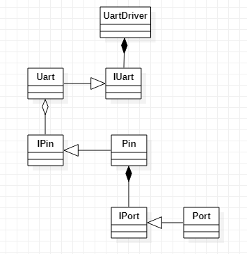
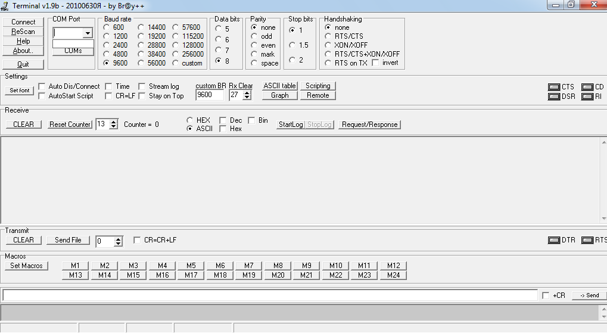
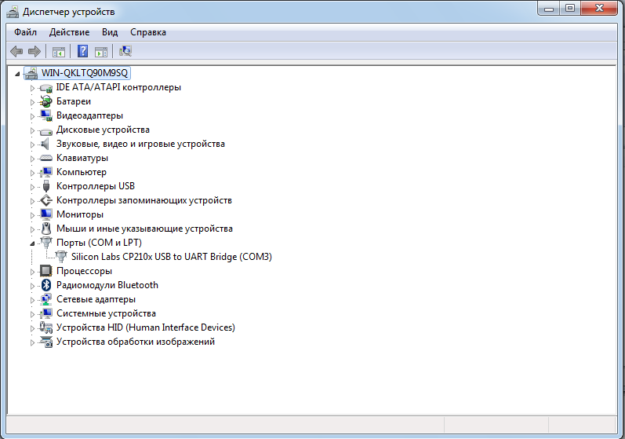
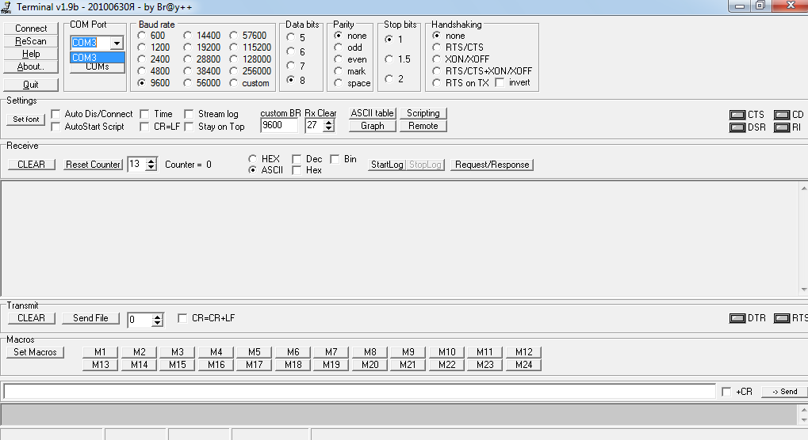
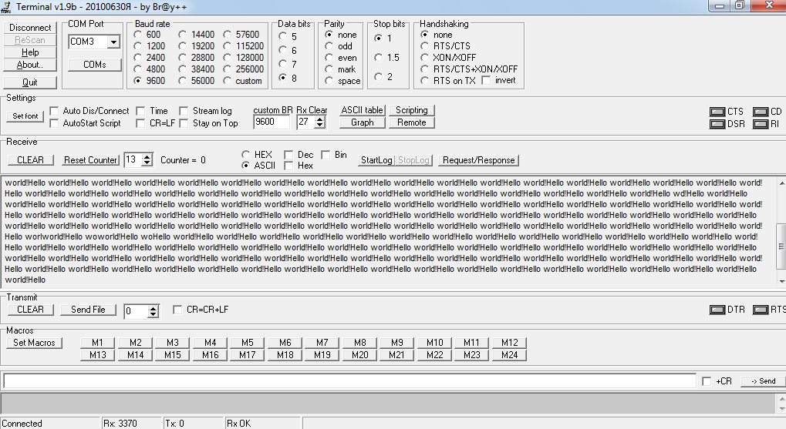

# Lab8_UART

<!--
[Здесь](https://www.nxp.com/files-static/training_pdf/29021_S08_SLIN_WBT.pdf) на странице 4 можно почитать, из чего состоит передаваемое сообщение.
-->

## Исходное задание 

Осуществить передачу данных с использованием *UART*. 

Для этого необходимо инкапсулировать задачи, которые выполняет устройство *UART*, в отдельный класс. 
Также рекомендуется использовать прерывания. 

## Теоретический материал 

**Передача данных** (англ. **Data Transmission**) - это передача и прием данных (цифровой битовый поток или оцифрованный аналоговый сигнал) по физическому или логическому каналу передачи данных, согласно определённой топологии (схеме соединения устройств). 

На рисунке снизу представлены основные топологии, по которым можно соединять устройства и создавать с помощью этого сети и системы из нескольких устройств: 


**Последовательная передача данных** (англ. **Serial communication**) - это процесс посылки данных по одному биту за раз (т.е. последовательно) по каналу связи или компьютерной шине.

**Параллельная передача данных** (англ. **Parallel communication**) - это метод одновременной передачи нескольких двоичных цифр (битов). 

Основное различие между последовательной и параллельной передачей данных заключается в количестве электрических проводников, используемых на физическом уровне для передачи битов: 


Многие системы *последовательной передачи данных* изначально были разработаны для передачи данных на относительно большие расстояния, поскольку это позволяет снизить расходы на кабель. 

**Синхронная передача данных** (англ. **Synchronous transmission**) - это метод передачи данных, который характеризуется непрерывным потоком данных в форме сигналов, которые сопровождаются регулярными сигналами синхронизации, которые генерируются некоторым внешним механизмом синхронизации, предназначенным для обеспечения синхронизации отправителя и получателя друг с другом. 

**Асинхронная передача данных** (англ. ) - это режим последовательной передачи, в котором данные передаются в виде непрерывного потока байтов, разделенных стартовыми и стоповыми битами.

**Универсальный асинхронный приёмопередатчик** (англ. **Universal Asynchronous Receiver-Transmitter**, **UART**) - это устройство аппаратного уровня компьютера, которое используется для последовательной асинхронной передачи данных, в которой формат данных и скорость передачи настраиваема. 

Схема, иллюстрирующая работу *UART*, представлена на рисунке снизу: 


**Дуплекс** (англ. **Duplex**) - это *point-to-point* система, в которой соединительный провод связывает только два устройства или интегральных схемы. 

Различие между топологиями *Point-to-Point* и *Hub-and-Spoke* представлено на рисунке ниже: 


**Полнодуплексный способ связи** (англ. **Full-duplex**) - это способ связи между составными частями системы, который позволяет им одновременно отправлять и получать данные: 


**Полудуплексный способ связи** (англ. **Half-duplex**) - это способ связи, при котором отдельные части системы могут передавать друг другу данные, но не одновременно. 

Простейшая иллюстрация *полудуплексного* режима представлена на рисунке ниже: 


Ввиду того, что *UART* не имеет внешнего сигнала тактирования, принимающая и отправляющая сторона должны быть настроены на общую скорость передачи данных. 

Поскольку увеличение количества пинов на интегральной микросхеме увеличивает стоимость микросхемы, то с целью уменьшения количества пинов (для случаев, когда скорость передачи данных не так важна) многие схемы содержат последовательные шины *RS-232*, *SPI*, *I²C*, *UNI/O*, *1-Wire* и *PCI Express*.

**Пакет** (англ. **Packet**) - это единица передачи цифровых данных. 

UART Frame: 


**Сдвиговый регистр** (англ. **Shift register**) представляет собой тип цифровой схемы, использующей каскад триггеров, где выход одного триггера соединен со входом следующего. 
Они используют один тактовый сигнал, который заставляет данные, хранящиеся в системе, перемещаться из одного места в другое. 
При подключении последнего триггера обратно к первому, данные могут циклически перемещаться внутри переключателей в течение длительных периодов времени, и в этой форме они использовались как форма компьютерной памяти. 


## Проектирование 

Данно еприложение состоит из следующих частей: 
- **Uart**: отвечает за отсылку сообщения по *UART*; 
- **UartDriver**: производит настройку *UART* и является оболочкой для более удобного взаимодействия с *UART*; 
- **Timer**: отвечает за таймер (в данной работе используется *TIM2*); 
- **UartDriver**: производит настройку таймера и является оболочкой для более удобного взаимодействия с таймером. 

<!--
Архитектура приложения представлена на рисунке ниже: 


-->

## Выполнение работы 

### Настройка COM-портов 

<!--
Сократить данный раздел вдвое. 
-->

Для выполнения данной работы в качестве графического интерфейса используется **Terminal v1.9b**. 

Подключаем штекер в разъём *USB TO UART* на плате микроконтроллера и подсоединяем к компьютеру. 
Если при использовании программы **Terminal** не обнаруживаются доступные COM-порты (как показано на рисунке снизу), то необходимо обновить драйверы.  



Перейдём на оффициальный сайт [Silicon Laboratories](https://www.silabs.com/developers/usb-to-uart-bridge-vcp-drivers) и скачаем драйвер для работы с виртуальным COM-портом (VCP). 

После обновления драйвера зайдём в *Диспетчер устройств* и проверим, что всё работает: 



Как видно на скриншоте сверху, теперь последовательный порт распознаётся как **COM3**. 
Снова запустим программу **Terminal** и проверим, виден ли теперь *COM-порт*: 



Теперь попробуем записать код в плату и проверить работает ли отправка сообщения "Hello world" с помощью *UART*. 

### Выполнение работы 

#### Код программы 

Файл `main.cpp`: 
```C++
#include "uartdriver.hpp"
#include "timers.hpp"
#include "timersdriver.hpp"

#include "rccregisters.hpp"
#include "rccfieldvalues.hpp"
#include "gpiocregisters.hpp"
#include "gpioaregisters.hpp"
#include "usart2registers.hpp"          // for UART2.

// Set UART data rate equal to 9600 bps. 
constexpr std::uint32_t UartSpeed9600 = std::uint32_t(8000000U / 9600U);

extern "C"
{
  int __low_level_init(void)
  {
    RCC::CR::HSEON::On::Set();
    while (!RCC::CR::HSERDY::Ready::IsSet());
    RCC::CFGR::SW::Hse::Set();

    while (!RCC::CFGR::SWS::Hse::IsSet());
    RCC::CR::HSION::Off::Set();

    RCC::AHB1ENR::GPIOAEN::Enable::Set();       // Enable GPIOA port. 
    
    RCC::APB1ENR::USART2EN::Enable::Set();      // Connect USART to clocking source. 
    
    // USART ports configuration. 
    GPIOA::MODER::MODER2::Alternate::Set();     // Set port as alternative for Uart2 TX.
    GPIOA::MODER::MODER3::Alternate::Set();     // Set port as alternative for Uart2 RX.
    GPIOA::AFRL::AFRL2::Af7::Set();             // Specify alternate mode Uart2 TX. 
    GPIOA::AFRL::AFRL3::Af7::Set();             // Specify alternate mode Uart2 RX. 
    GPIOA::OTYPER::OT3::OutputPushPull::Set();  // Output push-pull (reset state). 
    GPIOA::PUPDR::PUPDR3::PullUp::Set();        // Port x configuration bits: these bits are written by software to configure the I/O pull-up or pull-down. 
        
    // USART data format configuration. 
    USART2::CR1::M::Value0::Set();              // 1 Start bit, 8 Data bits, n Stop bit
    USART2::CR1::OVER8::Value0::Set();          // Oversampling by 16
    //USART2::CR1::PS::Value1::Set();             // Odd parity. 
    //USART2::CR1::PCE::Value1::Set();            // Parity control enabled.
    USART2::CR2::STOP::Value0::Set();           // 1 Stop bits: these bits are used for programming the stop bits.
    USART2::CR2::LINEN::Value1::Set();          // LIN mode enabled: This bit is set and cleared by software.
    USART2::BRR::Write(UartSpeed9600);          // Set baud rate for USART. 
        
    return 1;
  }
}

int main()
{
  constexpr char *str = "Hello world!";         // Message to be send. 

  UartDriver uartdriver; 
  TimersDriver timersdriver; 
  timersdriver.Config(8000U, 1000U, 0U); 
  
  while (true)
  {
    uartdriver.SendMessage(str, strlen(str)); 
    timersdriver.Sleep(); 
  }
  
  return 0;
}
```

Файл `uartdriver.hpp`: 
```C++
#ifndef _UARTDRIVER_HPP_
#define _UARTDRIVER_HPP_

#include "uartconfig.hpp"       // for declaration of `Uart` class using UART2. 

#include <cassert>
#include <array>

/*
* Provides method for sending a message using UART. 
*/
class UartDriver
{
public: 
  UartDriver() {}

  /*
  * Sends a message via UART. 
  * 
  * In infinite `for` loop checks if a message is completely sent. 
  * If it is true, set byte index equal to zero, disable interrupts 
  * and disable transmission. 
  * If it is false, checks if transfer register is empty. 
  * 
  * If transfer register is empty, write next byte into transfer register. 
  * If transfer register is not empty, do nothing and repeat the cycle again. 
  */ 
  void SendMessage(const char* message, size_t aSize)
  {
    assert(size <= 255);
    memcpy(buffer.data(), message, aSize);
    size = aSize;
    byteIndex = 0U;
    
    for(;;)
    {
      uart.InterruptsEnable(); 
      uart.TransmitEnable(); 
      
      if (byteIndex >= size)      // Check if message is completely sent. 
      {
        byteIndex = 0U;           // Set index equal to zero. 

        uart.InterruptsDisable(); 
        uart.TransmitDisable(); 

        break; 
      }

      if (uart.IsTransferRegisterEmpty())
      {
        uart.WriteByte(buffer[byteIndex++]); 
      }
    }
  }

private:
  std::uint8_t byteIndex = 0; 
  size_t size = 0; 
  std::array<std::uint8_t, 255> buffer; 
};

#endif // _UARTDRIVER_HPP_
```

В классе `UartDriver` посылка сообщения осуществляется в бесконечном цикле. 
Это неправильно с точки зрения расширяемости системы: расширить систему при таком подходе будет невозможно, так как бесконечный цикл блокирует выполнение программы, и в том участке программы наматываются пустые циклы.

Решить это можно с помощью асинхронных методов (например, с использованием [<future>](https://docs.microsoft.com/en-us/cpp/standard-library/future?view=msvc-160)) или использования двух таймеров: один для отправки сообщения (*TIM2*), а другой - для проверки условия (*TIM3*, к примеру). 
Но это не было реализовано из-за нехватки времени. 

Файл `uart.hpp`:
```C++
#ifndef _STM32LABS_UART_HPP_
#define _STM32LABS_UART_HPP_

#include <cstdint>

/*
* Abstract base class for UART. 
*/
class IUartBase
{
public:
  virtual void WriteByte(std::uint8_t byte) = 0;
  virtual void TransmitEnable() = 0; 
  virtual void TransmitDisable() = 0; 
  virtual void InterruptsEnable() = 0; 
  virtual void InterruptsDisable() = 0; 
};

/*
* Template class for UART. 
*/
template<typename UartReg>
class Uart : public IUartBase
{
public: 
  Uart()
  {
  }
  
  void WriteByte(std::uint8_t byte)
  {
    UartReg::DR::Write(byte);
  } 

  /*
  * Returns true if transmit data register is empty and TXE interrupt 
  * enableb. 
  */
  bool IsTransferRegisterEmpty()
  {
    bool isRegisterEmpty = UartReg::SR::TXE::Value1::IsSet();           // Data is transferred to the shift register. 
    bool isInterruptEnabled = UartReg::CR1::TXEIE::Value1::IsSet();     // An USART interrupt is generated whenever TXE=1 in the USART_SR register. 

    return isRegisterEmpty && isInterruptEnabled; 
  }

  void TransmitEnable()
  {
    UartReg::CR1::TE::Enable::Set();                    // Transmitter is enabled. 
    UartReg::CR1::RE::Enable::Set();                    // Receiver is enabled and begins searching for a start bit. 
  }

  void TransmitDisable()
  {
    UartReg::CR1::TE::Enable::Set();                    // Transmitter is disabled. 
    UartReg::CR1::RE::Disable::Set();                   // Receiver is disabled. 
  }

  void InterruptsEnable()
  {
    UartReg::CR1::TXEIE::Value1::Set();                 // An USART interrupt is generated whenever TXE=1 in the USART_SR register. 
  }

  void InterruptsDisable()
  {
    UartReg::CR1::TXEIE::Value0::Set();                 // Interrupt is inhibited. 
  }
};

#endif  // _STM32LABS_UART_HPP_
```

Файл `timersdriver.hpp`: 
```C++
#ifndef _TIMERSDRIVER_HPP_
#define _TIMERSDRIVER_HPP_

#include "timers.hpp"
#include "timersconfig.hpp"

class TimersDriver
{
public: 
  void Config(std::uint16_t prescaler, std::uint16_t arr, 
    std::uint16_t counter);
  void Sleep(); 
}; 

#endif  // _TIMERSDRIVER_HPP_
```

Файл `timersdriver.cpp`: 
```C++
#include "timersdriver.hpp"

void TimersDriver::Config(std::uint16_t prescaler, std::uint16_t arr, 
  std::uint16_t counter)
{
  tim2.SetPrescaler(prescaler); 
  tim2.SetArr(arr); 
  tim2.SetCounter(counter); 
}

void TimersDriver::Sleep()
{
  tim2.Sleep(); 
}
```

Файл `timers.hpp`: 
```C++
#ifndef _STM32LABS_TIMERS_HPP_
#define _STM32LABS_TIMERS_HPP_

#include "tim2registers.hpp"

class ITimerBase
{
public: 
  virtual void SetPrescaler(std::uint16_t psc) = 0; 
  virtual void SetArr(std::uint16_t arr) = 0; 
  virtual void SetCounter(std::uint16_t psc) = 0; 
  virtual void Sleep() = 0; 
};

template<typename TimReg>
class Timer : public ITimerBase
{
public: 
  void SetPrescaler(std::uint16_t psc) 
  {
    TimReg::PSC::Write(psc) ;
  }

  void SetArr(std::uint16_t arr) 
  {
    TimReg::ARR::Write(arr) ;
  }

  void SetCounter(std::uint16_t psc) 
  {
    TimReg::CNT::Write(psc) ;
  }

  void Config()
  {
    TimReg::SR::UIF::NoUpdate::Set();
    TimReg::CR1::CEN::Enable::Set() ;
  }

  void Sleep()
  {
    while(TimReg::SR::UIF::NoUpdate::IsSet());
    TimReg::SR::UIF::NoUpdate::Set();
  }
};

#endif  // _STM32LABS_TIMERS_HPP_
```

Файл `timersconfig.hpp`: 
```C++
#ifndef _TIMERSCONFIG_HPP_
#define _TIMERSCONFIG_HPP_

#include "timers.hpp"

inline Timer<TIM2> tim2; 

#endif  // _TIMERSCONFIG_HPP_
```


#### Скриншоты выполнения программы 

Как видно на слайде ниже, сообщение "Hello World" успешно отправляется: 



## Использованная литература 

1. https://en.wikipedia.org/wiki/Data_transmission
1. https://en.wikipedia.org/wiki/Serial_communication
1. https://en.wikipedia.org/wiki/Parallel_communication
1. https://en.wikipedia.org/wiki/Computer_hardware
1. https://en.wikipedia.org/wiki/Universal_asynchronous_receiver-transmitter
1. https://en.wikipedia.org/wiki/Duplex_(telecommunications)
1. https://en.wikipedia.org/wiki/Shift_register
