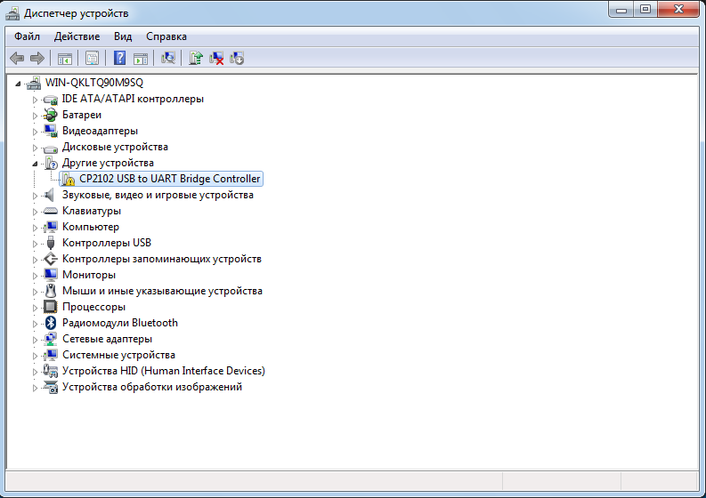
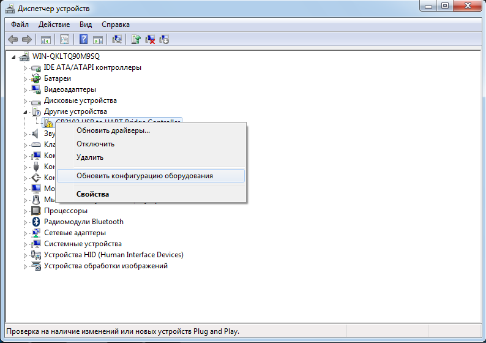
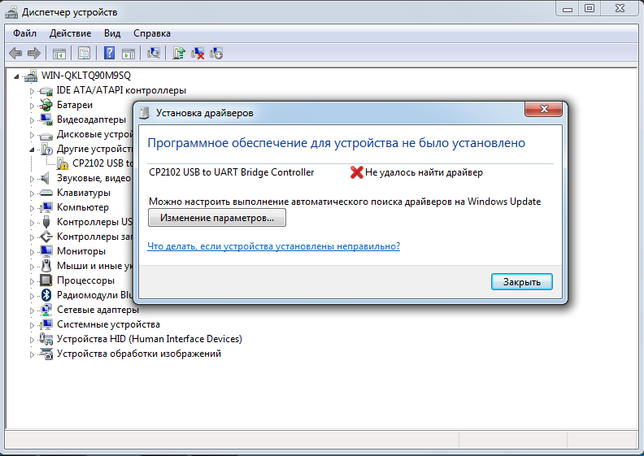

# Lab8_UART

<!--
[Здесь](https://www.nxp.com/files-static/training_pdf/29021_S08_SLIN_WBT.pdf) на странице 4 можно почитать, из чего состоит передаваемое сообщение.
-->

Для выполнения данной работы в качестве графического интерфейса используется **Terminal v1.9b**. 

## Настройка COM-портов

Подключаем штекер в разъём *USB TO UART* на плате микроконтроллера и подсоединяем к компьютеру. 
Далее заходим в программу **Terminal** и не обнаруживаем доступных COM-портов: 


Возможно, что необходимо обновить драйверы, поэтому заходим в *Диспетчер устройств* и видим, что есть некоторые проблемы с драйверами для работы с *UART*: 



Пробуем обновить конфигурацию устройства: 



И получаем следующее сообщение: 



[Здесь](https://www.silabs.com/documents/public/data-sheets/CP2102-9.pdf) можно прочитать про **CP2102 USB To UART Bridge Controller**, а [здесь](https://www.silabs.com/documents/public/application-notes/an197.pdf) про то, как работать с последовательными портами. 

Перейдём на оффициальный сайт [Silicon Laboratories](https://www.silabs.com/developers/usb-to-uart-bridge-vcp-drivers) и скачаем драйвер для работы с виртуальным COM-портом (VCP). 

После обновления драйвера зайдём в *Диспетчер устройств* и проверим, что всё работает: 


Как видно на скриншоте сверху, теперь последовательный порт распознаётся как **COM3**. 
Снова запустим программу **Terminal** и проверим, виден ли теперь *COM-порт*: 


Теперь попробуем записать код в плату и проверить работает ли отправка сообщения "Hello world" с помощью *UART*. 

## Передача сообщения "Hello world" с использованием UART

### Код программы 

Файл `main.cpp`: 
```C++
#include "rccregisters.hpp"
#include "rccfieldvalues.hpp"
#include "gpiocregisters.hpp"
#include "gpioaregisters.hpp"
#include "usart2registers.hpp"

// Set UART data rate equal to 9600 bps. 
constexpr std::uint32_t UartSpeed9600 = std::uint32_t(8000000U / 9600U);

extern "C"
{
  int __low_level_init(void)
  {
    RCC::CR::HSEON::On::Set();
    while (!RCC::CR::HSERDY::Ready::IsSet());
    RCC::CFGR::SW::Hse::Set();

    while (!RCC::CFGR::SWS::Hse::IsSet());
    RCC::CR::HSION::Off::Set();

    RCC::AHB1ENR::GPIOAEN::Enable::Set();       // Enable GPIOA port. 
    
    RCC::APB1ENR::USART2EN::Enable::Set();      // Connect USART to clocking source. 
    
    // USART ports configuration. 
    GPIOA::MODER::MODER2::Alternate::Set();     // Set port as alternative for Uart2 TX.
    GPIOA::MODER::MODER3::Alternate::Set();     // Set port as alternative for Uart2 RX.
    GPIOA::AFRL::AFRL2::Af7::Set();             // Specify alternate mode Uart2 TX. 
    GPIOA::AFRL::AFRL3::Af7::Set();             // Specify alternate mode Uart2 RX. 
    GPIOA::OTYPER::OT3::OutputPushPull::Set();  // Output push-pull (reset state). 
    GPIOA::PUPDR::PUPDR3::PullUp::Set();        // Port x configuration bits: these bits are written by software to configure the I/O pull-up or pull-down. 
        
    // USART data format configuration. 
    USART2::CR1::M::Value0::Set();              // 1 Start bit, 8 Data bits, n Stop bit
    USART2::CR1::OVER8::Value0::Set();          // Oversampling by 16
    //USART2::CR1::PS::Value1::Set();             // Odd parity. 
    //USART2::CR1::PCE::Value1::Set();            // Parity control enabled.
    USART2::CR2::STOP::Value0::Set();           // 1 Stop bits: these bits are used for programming the stop bits.
    USART2::CR2::LINEN::Value1::Set();          // LIN mode enabled: This bit is set and cleared by software.
    USART2::BRR::Write(UartSpeed9600);          // Set baud rate for USART. 
        
    return 1;
  }
}

int main()
{
  USART2::CR1::TE::Value1::Set();               // Transmitter is enabled. 
  USART2::CR1::RE::Value1::Set();               // Receiver is enabled. 
  
  USART2::CR1::UE::Value1::Set();               // USART enabled.
  
  constexpr char *str = "Hello world!";         // Message to be send. 
  const char *ptr = str;                        // Pointer to the message. 
  
  while (true)
  {
    // Dereference a pointer to message and write it into DR. 
    USART2::DR::Write(*ptr); 
    
    // While transmit data register empty, do nothing. 
   while(!USART2::SR::TXE::Value1::IsSet());
    
    ptr++;                                      // Increase pointer by one. 
    if (*ptr == 0)
    {
      ptr = str;
    }
  }
  
  return 0;
}
```

### Скриншоты выполнения программы 

Как видно на слайде ниже, сообщение "Hello World" успешно отправляется: 


Следующим шагом в данной работе будет отправка сообщения "Hello World" с использованием прерываний по таймеру. 

<!--
## Использование прерываний

### Код программы 

Файл `main.cpp`: 
```C++

```

### Скриншоты выполнения программы 


-->

