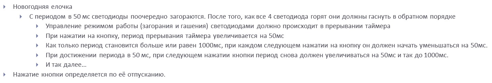
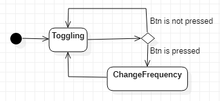
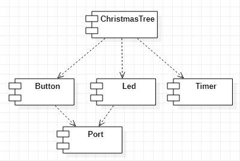
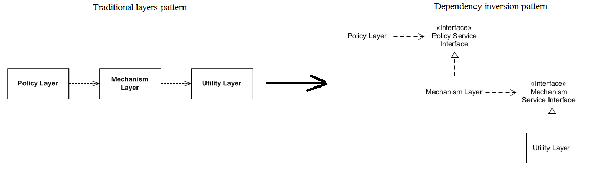
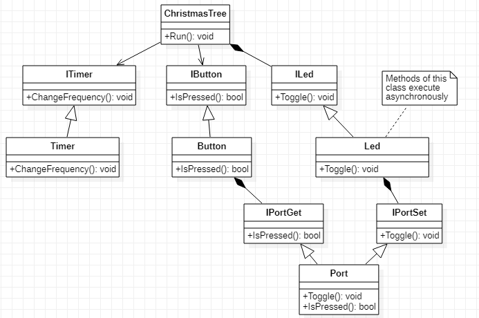

# Lab7 

## Содержание 

1. [Требования](#requirements)
2. [Проектирование приложения](#design)
    - [Use case diagram](#usecase)
    - [Statechart diagram](#statechart)
    - [Component diagram](#component)
    - [Теоретическая справка](#theory)
    - [Object model](#objects)
3. [Написание кода](#coding)

## Требования <div id="requirements"></div>

Задание представлено ниже. 



## Проектирование приложения <div id="design"></div>

### Statechart diagram <div id="statechart"></div>

<!--
Что такое Statechart-диаграмма, и для чего она применяется? 
-->

**Диаграмма состояний** (англ. **State diagram**) — диаграмма в виде ориентированного графа, в котором вершины обозначают состояния системы, а дуги показывают переходы между двумя состояниями. 

Применительно к программированию такие диаграммы позволяют определить состояния проектируемой системы в процессе того, как её использует пользователь. 
Это позволяет создать проект системы таким образом, чтобы она в максимальной степени соответствовала тому, как её будет использовать пользователь. 

*Statechart*-диаграмма для данного приложения представлена ниже: 



Как видно, приложение не имеет выхода, поэтому оно будет реализовываться в бесконечном цикле. 

### Component diagram <div id="component"></div>

На основе *Use case*- и *Statechart*-диаграмм уже понятно, каким функционалом обладает приложение. 
Это, в свою очередь, позволит поделить приложение на основные модули по зонам ответственности (и даже сделать предположение, как можно инкапсулировать весь этот функционал в конкретные классы). 

Как видно, в программе задействованы 3 функциональных компонента: 
1. Включение и выключение светодиодов в определённом порядке; 
2. Изменение частоты включения/выключения светодиодов; 
3. Определение нажатия кнопки. 

Эти компоненты можно связать на основе архитектуры *MVC* (англ. *Model-View-Controller*). 
Единственная ремарка - в данном задании нет необходимости реализовывать графический интерфейс, поэтому составляющей `View` в модели не будет совсем, однако сам принцип проектирования проложения будет заимствован из этой архитектуры. 

Класс `ChristmasTree` выступает в роли контроллера, в результате чего именно этот класс вызывает функционал кнопки `Button` и светодиода `Led`. 
Включение/выключение светодиодов производится по таймеру (это является вариантом реализации асинхронности в встроенных системах). 

На рисунке ниже представлен пример реализации такой архитектуры в рамках данного приложения: 



Архитектура *MVC* позволяет упорядочить процесс проектирования приложения таким образом, чтобы классы и прочие программные компоненты, находящиеся на одном уровне абстракции не зависели друг от друга, а вызывались из класса, находящегося на более высоком уровне абстракции. 

### Теоретическая справка <div id="theory"></div>

Для дальнейшей работы необходимо понимание некоторых теоретических идей. 

Концепты ООП: 
- **Инкапсуляция** (англ. **Encapsulation**) - это концепт ООП, который связывает вместе данные и функции, манипулирующие этими данными, защищая их, таким образом, от нежелательного использования сторонними функциями; 
- **Наследование** (англ. **Inheritance**) - это механизм, которые допускает возможность определения класса или объекта на основе другого класса или объекта, сохраняя похожую реализацию; 
- **Полиморфизм** (англ. **Polymorphism**) - это способность функции обрабатывать данные разных типов. 

Принципы SOLID: 
- *Single Responsibility Principle* (*SRP*) - принцип единственной ответственности. 

    Принцип SRP гласит: "Класс должен иметь лишь одну обязанность, и эта обязанность должна быть полностью инкапсулирована в этом классе". 

- *Open-Closed Principle* (*OCP*) - принцип открытости-закрытости. 

    Принцип OCP гласит: "Программные компоненты должны быть открыты для расширения и закрыты для изменения". 

- *Liskov Substitution Principle* (*LSP*) - принцип подстановки Барбары Лисков. 

    Принцип LSP гласит: "Объекты в программе должны быть заменяемы экземплярами их подтипов без нанесения вреда программе". 

- *Interface Segregation Principle* (*ISP*) - принцип . 
    
    Принцип ISP гласит: "Множество интерфейсов, реализующих одну специфичную задачу лучше, чем один интерфейс общего назначения". 

    Это означает, что перед тем, как вызвать модуль нижнего уровня, нужно создать интерфейс, содержащий объявления методов, которые он будет непосредственно использовать. 
    Иными словами, клиентский класс не должен зависеть от методов, которые он не использует.

- *Dependency Inversion Principle* (*DIP*). 

    Принцип DIP гласит: "Абстракции не должны зависеть от деталей (т.е. конкретной реализации). Конкретная реализация должна зависеть от абстракций".

    Та же самая идея передаётся альтернативной трактовкой данного принципа: "Модули более высокого уровня не должны напрямую зависеть от модулей низкого уровня. Но при этом и те, и другие модули должны зависеть от абстракций (например, интерфейсов)". 

    

**Абстрактный класс** (англ. **Abstract class**) - это базовый класс, который не предполагает создания экземпляров. 

Под **интерфейсом** (англ. **Interface**) часто имеется в виду класс в C++ с одними только чистыми виртуальными методами (т.е. без какого-либо кода). 
В то время, как под абстрактным классом часто имеется в виду класс в C++ с виртуальными методами, которые можно переопределить. 
В языке С++ нет разницы между интерфейсами и абстрактными классами в том плане, что использование ключевого слова `virtual` хотя бы один раз делает класс неинстанциремым ([источник](https://stackoverflow.com/questions/12854778/abstract-class-vs-interface-in-c)): 
```
class MyInterface
{
public:
  // Empty virtual destructor for proper cleanup
  virtual ~MyInterface() {}

  virtual void Method1() = 0;
  virtual void Method2() = 0;
};


class MyAbstractClass
{
public:
  virtual ~MyAbstractClass();

  virtual void Method1();
  virtual void Method2();
  void Method3();

  virtual void Method4() = 0; // make MyAbstractClass not instantiable
};
```

То есть *абстракный класс* - это тот класс, который не может иметь экземпляры; а *интерфейс* - это абстрактный метод, который вообще не имеет никакой реализации. 

Тогда зачем вообще использовать интерфейсы, когда есть абстрактные классы, которые определяют методы (и причём эти методы можно переопределить в наследуемом классе)? 

Объявление одной лишь сигнатуры метода делает так, что базовый класс не может быть создан, а производные классы вынуждены определять эти функции. 
Это помогает гарантировать, что производные классы не забудут переопределить функции, которые базовый класс ожидал от них.

Это может быть полезно, когда родительский класс не может обладать конкретной реализацией какого-то метода, но при этом его наследники однозначно реализуют этот метод. 
Например, класс `Animal` не может реализовывать метод `move()`, но его наследники его однозначно реализуют. 

### Object model <div id="objects"></div>

На основе описанных в предыдущем разделе концептов спроектируем зависимости между классами в рамках приложения. 



## Написание кода <div id="coding"></div>

Определим порты в файле `portsconfig.hpp`: 
```
#pragma once

#include "gpiocregisters.hpp" //for GPIOC
#include "gpioaregisters.hpp" //for GPIOA

#include "Port.hpp"

inline  Port<GPIOC> portC;
inline  Port<GPIOA> portA;
```

Далее определим и реализуем класс `Port` в файле `Port.hpp`:
```
#pragma once

#include <cstdint>
#include <cassert>

class IPortSet
{
public:
  virtual void Toggle(std::uint8_t num) = 0;
};

class IPortGet
{
public:
  virtual bool IsSet() = 0;
};

template <typename Reg>
class Port: public IPortSet, public IPortGet
{
public:
  void Toggle(std::uint8_t num) override
  {
     assert (num < 16);
     Reg::ODR::Toggle(1 <<num);
   }

  bool IsSet() override
  {
     return Reg::IDR::Get();
  }
};
```

Стоит заметить, что класс `Port` реализует два интерфейса - `IPortSet` (для светодиода `Led`) и `IPortGet` (для кнопки `Button`). 

А также класс `Port` является шаблонным, поэтому его реализацию желательно выполнять в одном и том же файле. 

Класс `Button` определён в файле `Button.hpp` следующим образом:
```
#pragma once
#include "Port.hpp"

class IButton
{
public:
  virtual bool IsPressed() = 0;
};

class Button : public IButton
{
public:
  Button(uint8_t num, IPortGet& aPin);
  
  bool IsPressed();

private:
  uint8_t number; 
  IPortGet& pin;
};
```

Данный класс также реализует интерфейс - `IButton`. 

Реализация класса `Button` (файл `Button.cpp`): 
```
#pragma once
#include "Port.hpp"

class IButton
{
public:
  virtual ~IButton() {}
  virtual bool IsPressed() = 0;
};

class Button : public IButton
{
public:
  Button(uint8_t num, IPortGet& aPin);
  
  bool IsPressed();

private:
  uint8_t number; 
  IPortGet& pin;
};
```

Класс `Led` определён в файле `Led.hpp` следующим образом: 
```
#pragma once
#include "Port.hpp"

class Led
{
public:
  Led(uint8_t num, IPortSet& aPin);
  void Toggle();

private:
  uint8_t number; 
  IPortSet& port;
};
```

Реализован класс `Led` в файле `Led.cpp` следующим образом: 
```
#include "Led.hpp"

Led::Led(uint8_t num, IPortSet& aPin): number(num), port(aPin)
{
}

void Led::Toggle()
{
   port.Toggle(number);
}
```

Класс `ChristmasTree` определён в файле `ChristmasTree.hpp`: 
```
#pragma once

#include "Button.hpp"
#include "Led.hpp"
#include "Timer.hpp"
#include "portsconfig.h"
#include <array>

class ChristmasTree
{
public: 
  ChristmasTree(IButton* aButton);
  void Run();
  void Update(); 
  
  Timer timer;

private:
  IButton* button;
  std::array<Led, 4> leds;
  int i=0;
}; 

extern ChristmasTree ct;
```

Класс `ChristmasTree` реализован в файле `ChristmasTree.cpp`: 
```
#include "ChristmasTree.hpp"

ChristmasTree::ChristmasTree(IButton* aButton): button(aButton), leds {
                                                      Led(5, portC),
                                                      Led(8, portC),
                                                      Led(9, portC),
                                                      Led(5, portA)
                                                     }
{
}

void ChristmasTree::Run()
{
  timer.Start();
  
  while(true)
  {
    if(button->IsPressed())
    {
      timer.ChangeFrequency();
    }
  }
}

void ChristmasTree::Update()
{
  leds[i].Toggle();
  i = (i + 1) & 0x3;
}
```

Класс `Timer` определён в файле `Timer.hpp`:
```
#pragma once
#include <cstdint>
#include "led.hpp"
#include "tim2registers.hpp"
#include "nvicregisters.hpp"

class Timer
{
public :
  void ChangeFrequency();
  void Start();
};
```

Класс `Timer` реализован в файле `Timer.cpp`:
```
#include "Timer.hpp"

void Timer::ChangeFrequency()
{
  int min = 49;
  int max = 999;

  // We assume that at initial point delay is equal to 1000 ms.
  // So variable called isForward should be equal to 1 at initial point
  // because a few steps later we need to toggle it.
  static bool isForward = 1;

  // If this function was invoked, you should anyway update TIM2_CNT.
  TIM2::CNT::Write(0);

  // If delay is equal to min or max, change direction.
  if (TIM2::ARR::Get() == min || TIM2::ARR::Get() == max)
  {
    isForward = !isForward;
  }

  // Set new delay.
  if (isForward == 0)
  {
    TIM2::ARR::Write(TIM2::ARR::Get() - 50);
  }
  else
  {
    TIM2::ARR::Write(TIM2::ARR::Get() + 50);
  }
}

void Timer::Start()
{
  TIM2::CR1::CEN::Enable::Set();
}
```

Вектор прерываний определён в файле `startup.cpp`: 
```
#include "interrupthandler.hpp"  //for InterruptHandler

extern "C" void __iar_program_start(void) ;

using tIntFunct = void(*)();
using tIntVectItem = union {tIntFunct __fun; void * __ptr;};
#pragma segment = "CSTACK"
#pragma location = ".intvec"
const tIntVectItem __vector_table[] =
{
  { .__ptr = __sfe( "CSTACK" ) }, //????????????? ????????? ?? ????
    __iar_program_start, //????? ??????? ????? ????? ? ?????????

  InterruptHandler::DummyHandler,
  InterruptHandler::DummyHandler,
  InterruptHandler::DummyHandler,
  InterruptHandler::DummyHandler,
  InterruptHandler::DummyHandler,
  0,
  0,
  0,
  0,
  InterruptHandler::DummyHandler,
  InterruptHandler::DummyHandler,
  0,
  InterruptHandler::DummyHandler,
  InterruptHandler::DummyHandler,
  //External Interrupts
  InterruptHandler::DummyHandler,         //Window Watchdog
  InterruptHandler::DummyHandler,         //PVD through EXTI Line detect/EXTI16
  InterruptHandler::DummyHandler,   //Tamper and Time Stamp/EXTI21 
  InterruptHandler::DummyHandler,         //RTC Wakeup/EXTI22 
  InterruptHandler::DummyHandler,             //FLASH
  InterruptHandler::DummyHandler,               //RCC
  InterruptHandler::DummyHandler,         //EXTI Line 0
  InterruptHandler::DummyHandler,         //EXTI Line 1
  InterruptHandler::DummyHandler,         //EXTI Line 2
  InterruptHandler::DummyHandler,        //EXTI Line 3
  InterruptHandler::DummyHandler,         //EXTI Line 4
  InterruptHandler::DummyHandler,       //DMA1 Stream 0
  InterruptHandler::DummyHandler,       //DMA1 Stream 1
  InterruptHandler::DummyHandler,       //DMA1 Stream 2
  InterruptHandler::DummyHandler,       //DMA1 Stream 3
  InterruptHandler::DummyHandler,       //DMA1 Stream 4
  InterruptHandler::DummyHandler,      //DMA1 Stream 5
  InterruptHandler::DummyHandler,      //DMA1 Stream 6
  InterruptHandler::DummyHandler,              //ADC1
  0,   //USB High Priority
  0,    //USB Low  Priority
  0,               //DAC
  0,              //COMP through EXTI Line
  InterruptHandler::DummyHandler,         //EXTI Line 9..5
  InterruptHandler::DummyHandler,              //TIM9/TIM1 Break interrupt 
  InterruptHandler::DummyHandler,             //TIM10/TIM1 Update interrupt
  InterruptHandler::DummyHandler,             //TIM11/TIM1 Trigger/Commutation interrupts
  InterruptHandler::DummyHandler,			   //TIM1 Capture Compare interrupt
  InterruptHandler::Tim2Handler,         //TIM2  	
  InterruptHandler::DummyHandler,         //TIM3
  InterruptHandler::DummyHandler,        ////TIM4
};

extern "C" void __cmain(void) ;
extern "C" __weak void __iar_init_core(void) ;
extern "C" __weak void __iar_init_vfp(void) ;

#pragma required = __vector_table
void __iar_program_start(void) {
  __iar_init_core() ;
  __iar_init_vfp() ;
  __cmain() ;
}
```

Обработчик прерываний `InterruptHandler` определён в файле `interrupthandler.hpp`: 
```
#ifndef REGISTERS_INTERRUPTHANDLER_HPP
#define REGISTERS_INTERRUPTHANDLER_HPP

#include "tim2registers.hpp" //for TIM2
#include "gpiocregisters.hpp" //for TIM2
#include "ChristmasTree.hpp" //for TIM2

class InterruptHandler {
public:
  static void DummyHandler();
  static void Tim2Handler();
};

#endif
```

Обработчик прерываний `InterruptHandler` реализован в файле `interrupthandler.cpp`:
```
#include "interrupthandler.hpp"

void InterruptHandler::DummyHandler()
{
  while(true); 
}

void InterruptHandler::Tim2Handler()
{
  if (TIM2::SR::UIF::UpdatePending::IsSet()) 
  { 
    TIM2::SR::UIF::NoUpdate::Set();
    ct.Update();
  }
}
```

Файл `main.cpp`:
```
#include "Port.hpp"
#include "ChristmasTree.hpp"
#include "Timer.hpp"
#include "Button.hpp"

#include "gpiocregisters.hpp" //for GPIOC
#include "gpioaregisters.hpp" //for GPIOA
#include "rccregisters.hpp"   //for RCC
#include "tim2registers.hpp"   //for SPI2
#include "nvicregisters.hpp"  //for NVIC

extern "C"
{
  int __low_level_init(void)
  {
    
    //Switch on clock on PortA and PortC,
    RCC::AHB1ENRPack<
      RCC::AHB1ENR::GPIOCEN::Enable,
      RCC::AHB1ENR::GPIOAEN::Enable
      >::Set() ;
    
    RCC::APB1ENRPack<
      RCC::APB1ENR::TIM2EN::Enable,  
      >::Set() ;
    
    // LED1 on PortA.5, set PortA.5 as output
    GPIOA::MODER::MODER5::Output::Set() ;
        
    
    // LED2 on PortC.9, LED3 on PortC.8, LED4 on PortC.5 so set PortC.5,8,9 as output
    GPIOC::MODERPack<
      GPIOC::MODER::MODER5::Output,
      GPIOC::MODER::MODER8::Output,
      GPIOC::MODER::MODER9::Output
    >::Set() ;
        
    
     NVIC::ISER0::Write(1 << 28) ;
     TIM2::PSC::Write(8000) ;
     TIM2::ARR::Write(1000) ;
     TIM2::DIER::UIE::Enable::Set() ;
     TIM2::SR::UIF::NoUpdate::Set();
     TIM2::CNT::Write(0);
     TIM2::CR1::CEN::Enable::Set() ; 
    return 1;
  }
}

IButton* button = new Button(13, portC);
ChristmasTree ct(button);

int main()
{
  ct.Run(); 
  
  ct.~ChristmasTree(); 
  button->~IButton(); 
  
  return 0;
}
```

## Использованные ресурсы 

1. https://en.wikipedia.org/wiki/Actor_(UML)
2. https://en.wikipedia.org/wiki/State_diagram
3. https://en.wikipedia.org/wiki/Object-oriented_programming
4. https://en.wikipedia.org/wiki/Abstraction_(computer_science)
5. https://en.wikipedia.org/wiki/SOLID
6. https://ru.wikipedia.org/wiki/Абстрактный_класс
7. https://stackoverflow.com/questions/12854778/abstract-class-vs-interface-in-c
8. https://www.geeksforgeeks.org/pure-virtual-functions-and-abstract-classes/
